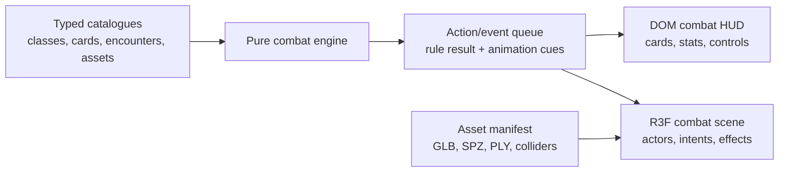

# feat: Build 3D Rogue Deck Engine Foundation

## Summary

Build the first engine slice for a Slay the Spire-inspired fantasy deck battler in React, with a React Three Fiber 3D scene and a DOM-based 2D combat interface. The plan prioritises data-driven game rules, extensible card and actor catalogues, and asset-loader seams so cards, monsters, classes, GLB actions, SPZ/PLY scenes, and collider meshes can be expanded later without rewriting the core engine.

---

## Problem Frame

The repository is currently a greenfield shell with only a README. The first useful milestone is not polished content; it is a small, playable architecture that proves combat state, card play, 3D presentation, and asset contracts can evolve independently.

---

## Assumptions

*This plan was authored without synchronous user confirmation. The items below are agent inferences that fill gaps in the input -- un-validated bets that should be reviewed before implementation proceeds.*

- "Normal Slay the Spire game rule" is interpreted as a compact first combat loop: draw, hand, energy/action points, block/shield, enemy intent, end turn, victory, and defeat.
- The initial game does not need map routing, relics, potions, rewards, shop buying, card upgrades, or persistence beyond an in-session card destroy effect.
- Starter decks should be deterministic for now: each class starts with its class attack, its class defend, and the shared heal card.
- The 3D implementation may use primitive placeholder models initially, but loader contracts must support future GLB actions and SPZ/PLY world assets.
- Collider mesh support means a manifest and runtime placeholder boundary for colliders in this slice; full navigation/pathfinding is deferred.

---

## Requirements

- R1. Provide a React-hosted 3D browser game scaffold with React Three Fiber for the world scene and DOM overlays for the 2D combat interface.
- R2. Keep gameplay simulation state outside render components so combat rules can be tested and extended independently of the scene.
- R3. Define two playable classes, each with five class-specific card definitions, and five general card definitions shared across classes.
- R4. Create starter decks containing exactly three cards: class attack, class defend, and general heal.
- R5. Implement first-pass card effects for attack, defend, super attack, two class-specific cards per class, +1 action this turn, heal, shield, repeat next action, and destroy a card for the current game session.
- R6. Define three monsters and one boss with data-driven stats, intents, and 3D presentation metadata.
- R7. Make every playable card resolve through an action/event layer that can trigger 3D effects and animation cues.
- R8. Add an asset manifest and scene-loader boundary for future GLB actor/action assets, SPZ and PLY world scenes, and collider meshes.
- R9. Provide focused tests for the engine and data catalogues, plus a build/smoke path that proves the app starts and renders.

---

## Scope Boundaries

- No shop purchasing flow in this slice, even though cards are planned to be bought from shops later.
- No map, node routing, encounter rewards, relics, potions, card upgrades, save slots, or long-term progression.
- No final EverQuest-like art direction, licensed assets, or polished production 3D models.
- No full physics gameplay, navigation mesh, or collision-based movement loop.
- No multiplayer, account system, analytics, or backend service.

### Deferred to Follow-Up Work

- Shop and card acquisition: future combat-to-shop progression work.
- Persistent run save and unlock structure: future progression work after the combat model stabilises.
- Production asset import pipeline: future art/asset pass using real GLB, SPZ, PLY, texture, animation, and collider files.
- Boss-specific mechanics beyond stronger stats and intent: future encounter-design pass.

---

## Context & Research

### Relevant Code and Patterns

- `README.md` is the only existing repository file, so implementation should establish the initial project conventions rather than mirror an existing app.
- React Three Fiber skill guidance: keep simulation state outside render components, use DOM HUD by default, and isolate scene root/camera/loader concerns.
- Web game foundation guidance: simulation owns game rules and saveable state; renderer owns scene composition, animation playback, camera, particles, and input plumbing.

### Institutional Learnings

- None found in-repo. This greenfield slice should favour explicit data contracts and tests so future decisions have local precedent.

### External References

- React Three Fiber stack: `@react-three/fiber`, `three`, `@react-three/drei`, `@react-three/rapier`, and optional postprocessing/a11y helpers.
- Drei `useGLTF` pattern for GLB loading.
- Three.js `PLYLoader` supports PLY geometry loading through the Three addons loader path.
- Spark `@sparkjsdev/spark` supports Gaussian splat assets including SPZ and PLY through `SplatMesh`/`SplatLoader`.

---

## Key Technical Decisions

- Use Vite + React + TypeScript: the repo is empty and this stack gives fast local iteration, good test support, and a natural host for React Three Fiber.
- Use React Three Fiber for 3D and DOM for HUD: this matches the requested 3D world plus 2D interface, while keeping text-heavy card UI accessible and easy to iterate.
- Store card, class, encounter, and asset metadata as typed data modules: this makes later content additions a catalogue change instead of a rule-engine rewrite.
- Put combat simulation in pure TypeScript modules: rules can be unit tested without a browser or WebGL context.
- Use an event/action queue between engine and renderer: card effects can produce gameplay changes plus animation cues without coupling cards to scene components.
- Treat SPZ/PLY support as an asset-loader seam in this first slice: placeholder scenes can render now, and real loaders can be wired as assets arrive.

---

## Open Questions

### Resolved During Planning

- Renderer choice: React Three Fiber is chosen because the game needs React-hosted 3D with a DOM interface overlay.
- Starter deck composition: use exactly two class cards and one general heal card as stated.
- First combat scope: implement a single playable encounter loop rather than shop/map/progression.

### Deferred to Implementation

- Exact class names and fantasy nouns: implementation may choose readable placeholder names, but they should be easy to rename in data.
- Exact combat numbers: implementation should pick small deterministic values that make the demo playable and tests stable.
- Exact SPZ runtime package shape: implementation should use a guarded adapter so the app can build even if no real SPZ asset is present yet.

---

## Output Structure

    docs/
      plans/
    src/
      App.tsx
      main.tsx
      styles.css
      data/
        assets.ts
        cards.ts
        classes.ts
        encounters.ts
      engine/
        actions.ts
        combat.ts
        deck.ts
        types.ts
      scene/
        AssetRenderer.tsx
        CombatScene.tsx
        GameCanvas.tsx
      ui/
        CombatHud.tsx
        ClassSelect.tsx
    tests/
      data.test.ts
      engine.test.ts

---

## High-Level Technical Design

> *This illustrates the intended approach and is directional guidance for review, not implementation specification. The implementing agent should treat it as context, not code to reproduce.*

The engine should expose deterministic actions such as start game, play card, end turn, resolve enemy intent, and start next encounter. The React layer should subscribe to snapshots and dispatch commands, while the R3F layer renders actors and visual cues from the latest snapshot/events.

---

## Implementation Units

### U1. Project Scaffold and Tooling

**Goal:** Create the Vite React TypeScript project foundation with build, test, lint-like type checks, and a minimal app shell.

**Requirements:** R1, R9

**Dependencies:** None

**Files:**
- Create: `package.json`
- Create: `index.html`
- Create: `tsconfig.json`
- Create: `tsconfig.node.json`
- Create: `vite.config.ts`
- Create: `vitest.config.ts`
- Create: `src/main.tsx`
- Create: `src/App.tsx`
- Create: `src/styles.css`
- Modify: `README.md`

**Approach:**
- Use Vite with React and TypeScript as the base application.
- Install React Three Fiber, Three, Drei, Rapier, postprocessing, and Spark dependencies up front so the project has the intended runtime seams.
- Keep the first page as the actual game surface, not a landing page.

**Patterns to follow:**
- React Three Fiber starter guidance for a compact canvas plus sparse HUD overlay.

**Test scenarios:**
- Test expectation: none -- project scaffolding will be verified by installing dependencies, running the build, and running the test suite once feature-bearing modules exist.

**Verification:**
- The app builds with TypeScript.
- The dev server can render the initial shell without a blank canvas.

### U2. Data Catalogues for Cards, Classes, Encounters, and Assets

**Goal:** Define typed game content for two classes, ten class-specific cards total, five general cards, starter decks, three monsters, one boss, and asset manifest entries.

**Requirements:** R3, R4, R5, R6, R8

**Dependencies:** U1

**Files:**
- Create: `src/data/cards.ts`
- Create: `src/data/classes.ts`
- Create: `src/data/encounters.ts`
- Create: `src/data/assets.ts`
- Create: `src/engine/types.ts`
- Test: `tests/data.test.ts`

**Approach:**
- Model card IDs, class IDs, actor IDs, asset references, card rarity/type, targeting, and action descriptors as TypeScript types.
- Use data arrays/maps with validation helpers so tests can assert catalogue integrity.
- Include GLB/SPZ/PLY/collider manifest metadata even when placeholder assets are used for rendering.

**Execution note:** Implement catalogue integrity tests first so later data additions preserve deck and card-count rules.

**Patterns to follow:**
- Prefer plain TypeScript data and exported lookup helpers over framework-bound state.

**Test scenarios:**
- Happy path: each class resolves to exactly five class cards and a starter deck of three cards.
- Happy path: each starter deck contains its class attack, its class defend, and the general heal card.
- Happy path: the general catalogue contains exactly five shared cards with unique IDs.
- Edge case: duplicate card, class, actor, or asset IDs are detected by catalogue validation.
- Integration: all encounter actor asset references resolve to entries in the asset manifest.

**Verification:**
- Catalogue tests pass and fail meaningfully for missing starter cards or broken asset references.

### U3. Pure Combat Engine

**Goal:** Implement the first deterministic combat rules slice: start encounter, draw cards, spend actions, play card effects, repeat next action, destroy-for-session, enemy intent, end turn, victory, and defeat.

**Requirements:** R2, R4, R5, R6, R7, R9

**Dependencies:** U2

**Files:**
- Create: `src/engine/actions.ts`
- Create: `src/engine/combat.ts`
- Create: `src/engine/deck.ts`
- Modify: `src/engine/types.ts`
- Test: `tests/engine.test.ts`

**Approach:**
- Keep combat state serialisable and renderer-free.
- Represent card play as commands that return a new combat state plus action events for UI and 3D animation.
- Interpret "+1 action for this turn" as increasing current action points by one.
- Interpret "repeat next action" as a one-shot pending modifier that replays the next card's rule effect once.
- Interpret "destroy a card in this game session" as removing a selected card instance from the current combat/run deck without deleting the card definition.

**Execution note:** Implement engine behaviour test-first, especially repeat-next-action and destroy-for-session because they are easy to couple incorrectly.

**Patterns to follow:**
- Pure reducer-style functions with explicit inputs and outputs.

**Test scenarios:**
- Happy path: starting a class encounter creates a shuffled/deterministic deck, draws a hand, and sets action points.
- Happy path: attack reduces a monster's health and emits an attack animation event.
- Happy path: defend/shield increase block and absorb enemy damage before health changes.
- Happy path: heal restores player health without exceeding max health.
- Happy path: +1 action increases available actions for the current turn only.
- Happy path: repeat next action causes the next action card's effect and event to resolve twice, then clears the modifier.
- Happy path: destroy-for-session removes a selected card instance from the run deck/discard/hand where appropriate while keeping the card definition available.
- Edge case: a card cannot be played without enough action points or with an invalid target.
- Edge case: combat reaches victory when all enemies are defeated and defeat when player health reaches zero.
- Integration: end turn resolves enemy intent, clears temporary block/action state, draws the next hand, and emits intent/action events.

**Verification:**
- Engine tests cover card effects and state transitions without mounting React.

### U4. React Game State and 2D Combat Interface

**Goal:** Build a playable DOM combat HUD for selecting class, viewing player/enemy state, playing cards, ending turn, and restarting encounters.

**Requirements:** R1, R2, R3, R4, R5, R6, R7

**Dependencies:** U3

**Files:**
- Modify: `src/App.tsx`
- Create: `src/ui/ClassSelect.tsx`
- Create: `src/ui/CombatHud.tsx`
- Modify: `src/styles.css`

**Approach:**
- Keep React state as a thin owner of the current engine snapshot and latest event log.
- Render cards as DOM buttons with clear disabled states, cost, effect text, and target handling.
- Keep the overlay compact so the 3D scene remains the first-viewport signal.

**Patterns to follow:**
- DOM overlays for HUD and menus, not in-canvas text-heavy UI.

**Test scenarios:**
- Test expectation: none -- this slice is better covered by browser smoke after the engine tests; UI test infrastructure can be added once interaction complexity grows.

**Verification:**
- A user can pick either class, play starter cards, end turns, and see combat state update.
- Disabled actions communicate when a card cannot currently be played.

### U5. React Three Fiber Scene and Asset Loader Seams

**Goal:** Create the 3D combat scene with placeholder fantasy actors, camera/lighting, card action visual cues, and manifest-based GLB/SPZ/PLY/collider loader boundaries.

**Requirements:** R1, R6, R7, R8

**Dependencies:** U2, U3, U4

**Files:**
- Create: `src/scene/GameCanvas.tsx`
- Create: `src/scene/CombatScene.tsx`
- Create: `src/scene/AssetRenderer.tsx`
- Modify: `src/App.tsx`
- Modify: `src/styles.css`

**Approach:**
- Use one scene root that owns `Canvas` and delegates combat rendering to child components.
- Render placeholder meshes when manifest assets are placeholders or missing.
- Add loader branches for GLB models, PLY scenes, SPZ splats, and collider metadata while keeping them defensive for absent files.
- Drive simple animation cues from the engine event log, such as attack pulses, defend shields, healing glow, and enemy intent.

**Patterns to follow:**
- R3F scene root isolation from gameplay state.
- Drei loader conventions for GLB.
- Three `PLYLoader` and Spark `SplatMesh` as future-compatible asset seams.

**Test scenarios:**
- Test expectation: none -- WebGL rendering is verified through build and browser smoke in this slice; loader branches should stay defensive until real assets exist.

**Verification:**
- The canvas is non-blank, shows player/enemy placeholders, and updates visual cues when cards are played.
- Missing optional assets do not crash the app.

### U6. Verification, Browser Smoke, and Documentation

**Goal:** Prove the engine slice works at the right boundary and document how future cards/assets should be added.

**Requirements:** R7, R8, R9

**Dependencies:** U1, U2, U3, U4, U5

**Files:**
- Modify: `README.md`
- Modify: `package.json`
- Test: `tests/data.test.ts`
- Test: `tests/engine.test.ts`

**Approach:**
- Add concise README instructions for running, testing, and extending catalogues/assets.
- Run unit tests for catalogues and engine behaviour.
- Run a production build and a browser smoke pass against the local dev server.

**Patterns to follow:**
- Keep documentation focused on extension points, not product marketing.

**Test scenarios:**
- Integration: production build succeeds with the R3F scene and all dependencies.
- Integration: browser smoke opens the app, verifies visible combat HUD content, and checks the canvas is not blank.

**Verification:**
- Tests, build, and browser smoke complete, or any failures are reported with exact commands and errors.

---

## System-Wide Impact

- **Interaction graph:** Engine commands produce state snapshots and action events consumed by DOM UI and R3F scene components.
- **Error propagation:** Invalid engine commands should return structured errors or disabled UI states rather than throwing from render components.
- **State lifecycle risks:** Repeat-next-action, temporary action points, block, destroyed card instances, and turn transitions are the highest-risk state boundaries.
- **API surface parity:** Data catalogues should remain usable by future shop, reward, and progression systems without changing card definitions.
- **Integration coverage:** Engine unit tests prove rules; browser smoke proves React/R3F wiring and non-blank rendering.
- **Unchanged invariants:** Card definitions are immutable content; per-run card instance state carries destroy/session effects.

---

## Risks & Dependencies

| Risk | Mitigation |
|------|------------|
| Renderer and engine become coupled early | Keep combat logic in pure TypeScript and pass only snapshots/events into React/R3F. |
| SPZ/PLY support becomes fragile without real assets | Build a manifest/adapter seam now, render placeholders defensively, and defer asset-specific validation until sample files exist. |
| Card effects become hard-coded and difficult to extend | Store effects as typed descriptors and resolve them through a central action interpreter. |
| Browser WebGL smoke is flaky in headless environments | Use unit tests and production build as the core verification, with browser smoke as an additional visual proof when tooling permits. |
| Initial content balance is arbitrary | Use deterministic, small values for now and keep numbers in catalogues for later tuning. |

---

## Documentation / Operational Notes

- README should explain how to add a new card, class, encounter, and asset manifest entry.
- Future real 3D assets should be placed under `public/assets/` and referenced by stable manifest keys, not hard-coded file paths in components.
- Collider mesh metadata should stay separate from visual asset metadata so physics/navigation can be introduced later without changing card or encounter data.

---

## Sources & References

- Related code: `README.md`
- Game Studio React Three Fiber guidance: `game-studio:react-three-fiber-game`
- Game Studio web game foundation guidance: `game-studio:web-game-foundations`
- External docs: [Three.js PLYLoader](https://threejs.org/docs/pages/PLYLoader.html)
- External docs: [Spark loading splats](https://sparkjs.dev/docs/loading-splats/)
- External docs: [React Three Fiber introduction](https://r3f.docs.pmnd.rs/getting-started/introduction)
