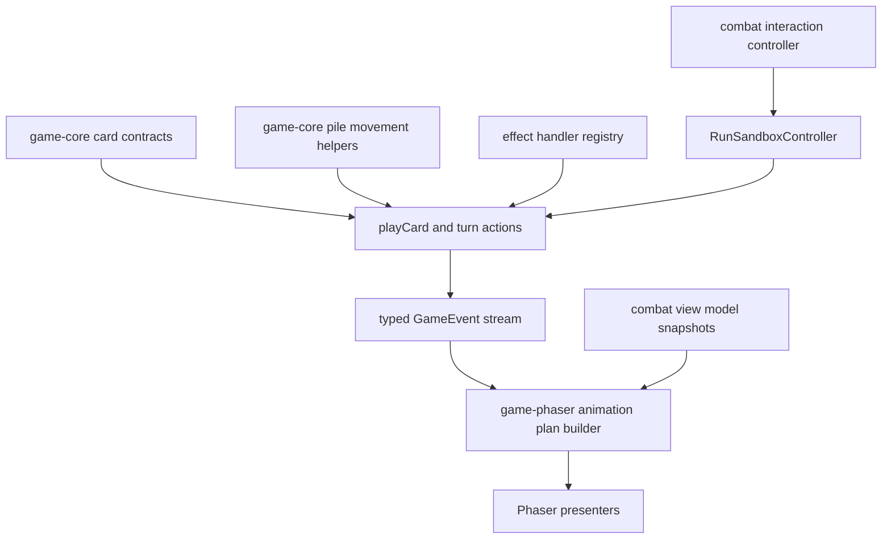

# Combat Enrichment Refactor Foundation Plan

## Summary

Refactor the combat card, effect, animation, and interaction foundations so new cards, pet commands, modifiers, and richer combat feedback can be added without repeatedly touching fragile scene-level orchestration.

## Problem Frame

Recent fixes around card movement and drag targeting exposed the same underlying issue: combat behaviour is deterministic in `src/game-core`, but the contracts consumed by Phaser are still inferred in multiple places. Card targetability, pile movement, effect resolution, event animation, and scene interaction state each have local rules. That makes enrichments expensive because every new card or target shape risks drift between validation, view-models, presenter animation, and input handling.

## Requirements

**Gameplay contracts**

- R1. Card playability and target requirements must have one authoritative typed contract that the core action layer and Phaser view-model layer can consume without duplicating target inference.
- R2. Card pile mutations must pass through shared core movement helpers that emit consistent `CardMoved` events and keep `drawPile`, `hand`, `discardPile`, and `exhaustPile` coherent.
- R3. Existing combat outcomes, event order, seeded RNG behaviour, and current card content must remain behaviourally unchanged except for intentionally tightened validation errors.

**Extensibility**

- R4. Effect resolution must be organised so adding a new effect type does not require extending one large conditional block.
- R5. The play-card path must expose clear stages for validation, cost modification, effect modification, effect execution, trigger resolution, and final card movement.
- R6. Pet modifier logic must remain multi-pet compatible and must preserve modifier limits, owner resolution, and trigger timing.

**Presentation and UX**

- R7. Phaser animation must consume a presentation-only animation plan derived from events and view-model snapshots, without moving gameplay logic into `src/game-phaser`.
- R8. Combat input handling must separate click, drag, keyboard, modal, and request-lock state from Phaser scene rendering concerns.
- R9. Existing drag-to-enemy, click-to-target, non-attack drag policy, draw animation, discard animation, and event log playback behaviours must keep working.

**Quality gates**

- R10. Each phase must complete self-review plus `npm run typecheck` and `npm test` before the next phase starts.
- R11. Core changes must have focused game-core tests for event order and rejection paths; Phaser changes must have focused tests for policy, view-model, presenter, and scene boundary behaviour.
- R12. `src/game-core` must continue to import no Phaser or browser-only APIs.

## Key Technical Decisions

- **Core owns action semantics:** Card play contracts and pile movement helpers belong under `src/game-core` because they describe gameplay truth, not input gestures.
- **Phaser owns gesture interpretation:** Drag zones, pointer positions, highlights, and animation plans stay under `src/game-phaser` because they translate UI state into already-valid core actions.
- **External APIs stay stable during refactor:** Public core action functions such as `playCard`, `endPlayerTurn`, `startPlayerTurn`, and `drawCards` should keep their current call shape unless a unit proves a small type addition is necessary.
- **Characterisation before reshaping:** Each unit should pin current event order and rejection behaviour before rearranging internals, so tests catch semantic drift.
- **Phase gates are hard boundaries:** No later-phase implementation begins until the current phase has passed review, typecheck, and the full test suite.

## High-Level Technical Design

The intended direction is not to add a large manager. The refactor should introduce small typed helpers and adapters that make each contract explicit while preserving the current deterministic event pipeline.

## Implementation Units

### U1. Card Action Contract and Pile Movement Foundation

- **Goal:** Create the shared core foundation for card target requirements and card pile movement, then update existing consumers to use it.
- **Files:** `src/game-core/model/card.ts`, `src/game-core/model/effect.ts`, `src/game-core/systems/combat.ts`, `src/game-core/systems/draw.ts`, `src/game-phaser/view-models/combat-view-model.ts`, `src/game-phaser/interaction/card-interaction-policy.ts`, `tests/game-core/combat-play-card.test.ts`, `tests/game-core/combat-draw.test.ts`, `tests/game-core/combat-turn.test.ts`, `tests/game-phaser/combat-view-model.test.ts`, `tests/game-phaser/card-interaction-policy.test.ts`.
- **Approach:** Add core-level helpers that derive whether a card needs an enemy target, self target, pet target, all-enemies handling, or no manual target from its effects. Add pile movement helpers that validate card existence, move a card between zones, and emit one `CardMoved` event per movement. Update draw, end-turn discard, and play-card discard to use the helper.
- **Patterns:** Follow existing immutable state updates in `src/game-core/systems/draw.ts` and `src/game-core/systems/combat.ts`. Keep Phaser-specific drop targets in `src/game-phaser/interaction`.
- **Test Scenarios:** Playing targetless cards rejects unexpected target ids; enemy-targeted cards require alive monster targets; all-enemies cards remain targetless; draw emits `CardMoved` then `CardDrawn` per card; end turn emits one hand-to-discard movement per remaining card; missing card instances reject with current error shape.
- **Verification:** Self-review changed lines, run focused game-core and game-phaser tests for card contracts and movement, then run `npm run typecheck` and `npm test`.

### U2. Effect Resolver and Play-Card Pipeline

- **Goal:** Split effect resolution and card play into typed stages without changing current observable event order.
- **Files:** `src/game-core/systems/effects.ts`, `src/game-core/systems/combat.ts`, `src/game-core/systems/pet-modifiers.ts`, `src/game-core/model/effect.ts`, `tests/game-core/combat-play-card.test.ts`, `tests/game-core/combat-pet-command.test.ts`, `tests/game-core/combat-status.test.ts`, `tests/game-core/pet-modifier-integration.test.ts`.
- **Approach:** Introduce small effect handlers for damage, block, draw, apply status, pet attack, pet block, pet react, and story flag warnings. Introduce a play-card pipeline that makes validation, pet-owner resolution, cost modifiers, effect modifiers, effect execution, post-effect triggers, and final card movement explicit.
- **Patterns:** Preserve `GameActionResult<CombatState>` return shapes and existing `ActionRejected` event semantics. Keep RNG flow injected through existing `Rng` parameters.
- **Test Scenarios:** Current event order for starter attack, block, draw, and pet-command cards remains unchanged; cost modifiers still emit before `EnergySpent`; effect modifiers still alter pet-command damage/status amounts; trigger-based draw still occurs after qualifying defeats; combat end still stops further effect repetition.
- **Verification:** Self-review changed lines, run focused core tests for play-card, pet-command, status, and modifiers, then run `npm run typecheck` and `npm test`.

### U3. Event Animation Plan and Interaction State Separation

- **Goal:** Move Phaser animation sequencing and combat input state out of `CombatScene` into presentation-layer helpers that are easier to extend.
- **Files:** `src/game-phaser/scenes/CombatScene.ts`, `src/game-phaser/animation/CombatEventPlayer.ts`, `src/game-phaser/animation/CombatEventFxPresenter.ts`, `src/game-phaser/presenters/CardPresenter.ts`, `src/game-phaser/interaction/card-interaction-policy.ts`, `src/game-phaser/interaction/combat-drop-target-resolver.ts`, new `src/game-phaser/animation/*` or `src/game-phaser/interaction/*` helpers, `tests/game-phaser/combat-event-player.test.ts`, `tests/game-phaser/combat-event-fx-presenter.test.ts`, `tests/game-phaser/card-presenter.test.ts`, `tests/game-phaser/combat-scene-boundary.test.ts`.
- **Approach:** Add a presentation-only animation planner that translates `GameEvent[]` plus before/after combat view models into animation commands for card movement and combat FX. Extract selection, hover, keyboard target, drop resolution, and input-lock decisions into a small interaction controller or state reducer that `CombatScene` delegates to.
- **Patterns:** Keep presenters responsible for Phaser GameObjects. Keep layout geometry in `src/game-phaser/layout` and semantic drop resolution in `src/game-phaser/interaction`.
- **Test Scenarios:** Card draw and discard still animate one movement per event; `CardPlayed` FX still starts from the real hand card point when available; drag-to-enemy still submits target ids; self/pet/board drop policy still routes non-attack cards correctly; scene boundary tests confirm gameplay resolver logic stays outside presenters and scene.
- **Verification:** Self-review changed lines, run focused Phaser animation and interaction tests, then run `npm run typecheck` and `npm test`.

### U4. Pet Modifier, Content Validation, and View-Model Builder Cleanup

- **Goal:** Clean up the enrichment surfaces that will grow fastest: pet modifier resolution, content validation, and combat view-model construction.
- **Files:** `src/game-core/systems/pet-modifiers.ts`, `src/game-core/systems/validation.ts`, `src/game-phaser/view-models/combat-view-model.ts`, new helper files under `src/game-core/systems` and `src/game-phaser/view-models`, `tests/game-core/registry.test.ts`, `tests/game-core/pet-modifier-*.test.ts`, `tests/game-phaser/combat-view-model.test.ts`, `tests/game-core/vertical-slice-content.test.ts`.
- **Approach:** Split pet modifier matching, usage limits, owner contexts, and trigger execution into focused helpers. Strengthen validation for card target compatibility, status references, pet references, modifier selectors, and effect payloads. Split combat view-model construction into card, combatant, pet, and intent builders while preserving exported view-model types.
- **Patterns:** Keep content data-driven. Do not hardcode card names. Preserve collection-based multi-pet models such as `activePetInstanceIds` and pet slots.
- **Test Scenarios:** Invalid content fails registry validation before runtime; pet modifier selectors handle tags, card types, required pet definitions, limits, and temporary modifiers; combat view-model output remains stable for current cards, pets, enemies, piles, warnings, and keyword copy.
- **Verification:** Self-review changed lines, run focused validation, pet modifier, and view-model tests, then run `npm run typecheck` and `npm test`.

## Scope Boundaries

- No new card content, pet content, rewards, relics, or story content unless needed solely for tests.
- No change to visual art direction, Phaser asset loading, sound, shaders, or production packaging.
- No React or alternate state-management dependency.
- No weakening of existing tests, boundary tests, seeded RNG tests, or event-order expectations.
- No migration away from Phaser 4.

## System-Wide Impact

This refactor touches the contract between deterministic core gameplay, view-model construction, Phaser event playback, and combat interaction. The work should therefore preserve the existing game-core boundary tests and add new tests where contracts move. The most important invariant is that `src/game-core` remains renderer-free while still exposing enough typed action semantics for Phaser to avoid re-inferring gameplay rules.

## Risks & Dependencies

- **Event-order drift:** Refactoring helpers can accidentally reorder `CardPlayed`, cost modification, `EnergySpent`, effect events, triggers, and `CardMoved`. Characterisation tests should pin the current order before each change.
- **Animation/state mismatch:** Moving card animation planning could reintroduce final-state rendering before event playback. Phaser tests should assert one-by-one movement still uses event order.
- **Over-abstraction:** The goal is small helpers, not a new framework. Any helper should remove duplicated rules or isolate a clear contract.
- **Dirty worktree config:** Existing `.compound-engineering/` local config changes should stay separate from functional commits unless intentionally persisted.

## Acceptance Examples

- AE1. Given a player ends a turn with two cards in hand, when the action resolves, then two `CardMoved` events move those exact cards from hand to discard before the turn-end event, and the Phaser presenter animates those two physical card visuals.
- AE2. Given a new player turn draws four cards, when event playback runs, then each draw movement appears one at a time and the hand does not jump to the final count before the matching events play.
- AE3. Given an enemy-targeted card is dragged onto a living enemy, when submitted, then the same core `playCard` path is used as click targeting and no scene-level gameplay resolver is introduced.
- AE4. Given a self or pet command card is dragged onto the compatible player, pet, or board target, when submitted, then the interaction policy accepts it without inventing a target id that core validation rejects.
- AE5. Given invalid content references an unknown effect type, status, pet, or modifier selector, when registry validation runs, then the issue is reported before gameplay starts.

## Documentation / Operational Notes

Each phase should leave the plan active until all phases are complete. If a phase requires a meaningful scope change, update this plan before implementation continues. Commit messages should identify the phase they complete so review can trace the staged refactor.

## Sources / Research

- Existing gameplay contracts: `src/game-core/model/card.ts`, `src/game-core/model/effect.ts`, `src/game-core/model/event.ts`, `src/game-core/model/combat.ts`.
- Current core action flow: `src/game-core/systems/combat.ts`, `src/game-core/systems/draw.ts`, `src/game-core/systems/effects.ts`, `src/game-core/systems/pet-modifiers.ts`, `src/game-core/systems/validation.ts`.
- Current Phaser presentation flow: `src/game-phaser/scenes/CombatScene.ts`, `src/game-phaser/view-models/combat-view-model.ts`, `src/game-phaser/animation/CombatEventPlayer.ts`, `src/game-phaser/animation/CombatEventFxPresenter.ts`, `src/game-phaser/presenters/CardPresenter.ts`, `src/game-phaser/interaction/card-interaction-policy.ts`, `src/game-phaser/interaction/combat-drop-target-resolver.ts`.
- Existing test anchors: `tests/game-core/combat-*.test.ts`, `tests/game-core/pet-modifier-*.test.ts`, `tests/game-phaser/combat-scene-boundary.test.ts`, `tests/game-phaser/card-presenter.test.ts`, `tests/game-phaser/card-interaction-policy.test.ts`, `tests/game-phaser/combat-event-player.test.ts`.
