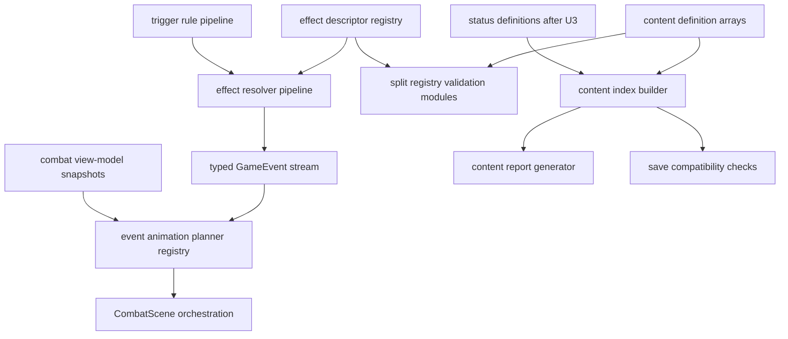

# Combat Expansion Refactor Plan

## Summary

Refactor the combat content, effect, status, trigger, animation, and save foundations so future cards, pets, upgrades, statuses, and encounters can be added with less duplicated code and stronger validation.

## Problem Frame

The current codebase has a healthy deterministic core and a guarded Phaser boundary, but the next expansion layer will stress several surfaces at once. Adding a new effect or content type currently requires changes across effect resolution, registry validation, card action profiling, view-model preview copy, animation planning, tests, and sometimes save handling. That is manageable for the first playable slice, but it will slow future content work and increase drift risk as the card pool, pet modifiers, statuses, and combat presentation grow.

This plan keeps the existing game behaviour stable while improving the contracts that future content authors and gameplay systems will rely on.

## Requirements

**Core extensibility**

- R1. Effect metadata, validation, target semantics, resolver keys, event-order expectations, and rejection behaviour must have one authoritative typed descriptor surface that `src/game-core` can consume without duplicating static effect-type conditionals.
- R2. Content validation must be split into focused modules while preserving the single public registry validation entry point.
- R3. Content lookup must support indexed access by id for current registry collections first, then statuses once U3 makes status definitions registry-backed.
- R4. Status definitions must become registry-backed and ready for additional deterministic timing hooks beyond Burn.
- R5. Trigger logic must first be extracted as a pet-modifier trigger pipeline, with future relic, status, or passive owners deferred until a second real consumer exists.

**Presentation extensibility**

- R6. Combat event animation planning must be registry-like and event-driven so new event visuals can be added without growing scene conditionals.
- R7. `CombatScene` must delegate event animation planning to focused Phaser-layer helpers, with input orchestration extraction limited to what is directly needed for safe animation playback.
- R8. View-model and presenter behaviour must continue to consume typed core contracts rather than re-inferring game rules from card names or local presentation state.

**Content authoring and operations**

- R9. Card and effect authoring helpers must reduce repeated object shapes while preserving data-driven content definitions and strict UK English docs/code copy.
- R10. A deterministic content report must summarise registered cards, effects, pet upgrades, statuses, encounters, and run-map coverage for review and balancing.
- R11. Save snapshots must record content version information and tolerate missing or renamed content through explicit validation or migration policy, not silent runtime failure.

**Quality gates**

- R12. Each implementation unit must be completed, self-reviewed, and validated with focused tests, `npm run typecheck`, and `npm test` before the next unit begins.
- R13. Core changes must include event-order, rejection-path, validation, and seeded-RNG tests where behaviour could drift.
- R14. Phaser changes must include animation planner, interaction, view-model, presenter, or scene-boundary tests as appropriate.
- R15. `src/game-core` must continue to import no Phaser, browser-only APIs, or presentation-layer modules.

## Key Technical Decisions

- **Descriptor-first effects:** The effect descriptor is the source of truth for static capability metadata, effect shape validation, target semantics, resolver keys, event-order expectations, and rejection behaviour. Resolver implementations remain separate behaviour-specific functions unless unifying them removes proven duplication without hiding semantics.
- **Registry indexes are built, not stored in content:** Content files stay as simple arrays of definitions. A `buildContentIndex` helper derives maps and reference sets at runtime/test time so authoring remains data-driven.
- **Content context owns index lifecycle:** Callers that need repeated lookups should accept a `ContentContext` such as `{ registry, index }` rather than rebuilding indexes independently. Existing APIs may keep registry-only overloads where repeated lookup is not material.
- **Status hooks remain deterministic:** Status timing is represented by typed definitions and resolver functions inside `src/game-core`; no arbitrary scripting or browser callbacks enter content data.
- **Trigger pipeline starts and stays with pet modifiers for this plan:** Pet modifiers already have trigger rules and limit tracking. Relic, status, and passive-effect owners are explicitly deferred until a second real consumer exists.
- **Phaser gets animation commands, not gameplay rules:** Animation planning can inspect `GameEvent` values and before/after view models, but it must not decide card legality, damage, pet ownership, or rewards. Broader drag/click orchestration is not part of U4 unless required to keep event playback correct.
- **Authoring helpers are optional compile-time ergonomics:** Helpers should make valid definitions shorter and safer, but plain data objects remain valid content.
- **Save compatibility is explicit and single-policy:** The first save/content versioning pass records versions and separates schema validation from content compatibility validation. It uses one current-registry compatibility path and does not introduce a policy abstraction until there are multiple real policies, aliases, or migration paths.

## High-Level Technical Design

The design favours small typed modules over a central manager. Each unit should reduce duplication or clarify a contract that future content must rely on.

## Implementation Units

### U1. Effect Descriptor Registry and Validation Split

- **Goal:** Introduce an authoritative effect descriptor registry and move card/effect validation out of the large registry validator into focused modules.
- **Files:** `src/game-core/model/effect.ts`, `src/game-core/systems/effects.ts`, `src/game-core/systems/card-actions.ts`, `src/game-core/systems/validation.ts`, new `src/game-core/systems/effect-descriptors.ts`, new validation helpers under `src/game-core/systems/validation/`, `src/game-core/index.ts`, `tests/game-core/card-actions.test.ts`, `tests/game-core/combat-play-card.test.ts`, `tests/game-core/registry.test.ts`.
- **Approach:** Define typed effect descriptors for current effect types: `damage`, `block`, `draw`, `applyStatus`, `petAttack`, `petBlock`, `petReact`, and `setStoryFlag`. Each descriptor should expose static capability metadata: target requirements, required payload fields, resolver key, event-order expectation, and rejection behaviour. Keep resolver implementations in behaviour-specific functions and route by descriptor key instead of moving all runtime semantics into descriptor objects. Split card/effect validation so the public registry validator delegates to smaller modules but keeps the same caller-facing API and issue shape where possible.
- **Patterns:** Follow the existing handler-table pattern in `src/game-core/systems/effects.ts` and the typed action profile helpers in `src/game-core/systems/card-actions.ts`.
- **Test Scenarios:** Unknown effect types still fail validation; every current effect type validates required payloads; each descriptor declares the current target requirement and resolver key; card action profiles match current target kinds; current card play event order remains stable; malformed effect payload tests stay precise.
- **Verification:** Self-review the descriptor and validator boundaries, run focused card action/combat/registry tests, then run `npm run typecheck` and `npm test`.

### U2. Content Index Layer

- **Goal:** Add a reusable indexed registry view so runtime, validation, reports, and view models stop repeatedly scanning arrays for common id lookups.
- **Files:** `src/game-core/model/registry.ts`, `src/game-core/data/registry.ts`, new `src/game-core/systems/content-index.ts`, `src/game-core/systems/validation.ts`, `src/game-core/systems/story.ts`, `src/game-core/systems/rewards.ts`, `src/game-phaser/view-models/combat-view-model.ts`, `src/game-phaser/view-models/run-view-model.ts`, `src/game-phaser/view-models/reward-view-model.ts`, `tests/game-core/registry.test.ts`, new `tests/game-core/content-index.test.ts`, existing view-model tests.
- **Approach:** Build `ContentIndex` from `GameContentRegistry` with maps and duplicate-id detection for the collections that exist before status registry work: cards, pets, players, monsters, encounters, run-map templates, pet upgrades, pet modifiers, story events, and pet side stories. Add a `ContentContext` boundary that carries `{ registry, index }` for validation, reports, save compatibility, and lookup-heavy view-model helpers. Use indexes first in validation and targeted hot lookup paths, then selectively update view models where the improvement is clear and low risk. Keep array order available for reward generation and deterministic iteration.
- **Patterns:** Preserve deterministic ordering by deriving maps from arrays without changing the arrays themselves.
- **Test Scenarios:** Duplicate ids are detected for existing collections; known ids resolve through the index; `ContentContext` reuses one index for repeated validation/report operations; missing ids return `undefined` rather than throwing unless the caller explicitly requires a definition; reward generation order remains stable; view-model output remains unchanged.
- **Verification:** Self-review index adoption for semantic drift, run focused registry/index/view-model tests, then run `npm run typecheck` and `npm test`.

### U3. Status Definitions and Pet Modifier Trigger Pipeline

- **Goal:** Make statuses registry-backed and extract pet modifier trigger behaviour into focused helpers without prebuilding unrelated owner types.
- **Files:** `src/game-core/model/status.ts`, `src/game-core/model/registry.ts`, `src/game-core/model/pet.ts`, `src/game-core/systems/content-index.ts`, `src/game-core/systems/statuses.ts`, `src/game-core/systems/pet-modifiers.ts`, new `src/game-core/systems/trigger-rules.ts`, `src/game-core/systems/validation/`, `src/game-core/data/registry.ts`, `src/game-phaser/view-models/combat-view-model.ts`, tests under `tests/game-core/combat-status.test.ts`, `tests/game-core/pet-modifier-*.test.ts`, `tests/game-core/registry.test.ts`, `tests/game-core/content-index.test.ts`, `tests/game-phaser/combat-view-model.test.ts`.
- **Approach:** Register Burn through the content registry or a status registry collection, extend `ContentIndex` with `statusesById`, then adjust validation and view-model status copy to reference registered statuses instead of a single hardcoded definition. Before extracting trigger code, define the pet modifier trigger contract: trigger windows, owner ordering, snapshot inputs, phase/outcome handling, whether trigger-generated effects may cascade into more triggers, and rollback behaviour on rejection. Extract trigger matching, limit checks, owner context, and effect execution into narrow pet-modifier helpers while keeping public behaviour unchanged. Do not add relic, status, or passive owner abstractions in this unit.
- **Patterns:** Preserve seeded RNG injection and current `PetModifierActivated` / `PetModifierConsumed` event ordering.
- **Test Scenarios:** Burn ticks exactly as before; unknown status references fail validation; duplicate status ids fail index validation; combat status labels/tooltips use registered status metadata with a deterministic fallback for unknown loaded statuses; golden event-order tests cover each existing pet modifier trigger before extraction; pet modifier trigger-on-defeated-with-status still draws after qualifying defeats; once-per-turn and once-per-combat limits remain stable; multi-pet trigger ownership remains stable; trigger-generated draw effects do not unexpectedly cascade into additional triggers unless the contract explicitly allows it.
- **Verification:** Self-review status hook and trigger owner boundaries, run focused status/modifier/registry tests, then run `npm run typecheck` and `npm test`.

### U4. Animation Plan Registry

- **Goal:** Convert combat animation planning into a registry-like event planner that supports future combat visuals without broad scene refactoring.
- **Files:** `src/game-phaser/scenes/CombatScene.ts`, `src/game-phaser/animation/combat-animation-plan.ts`, `src/game-phaser/animation/CombatEventPlayer.ts`, `src/game-phaser/animation/CombatEventFxPresenter.ts`, new helpers under `src/game-phaser/animation/` and `src/game-phaser/interaction/`, `tests/game-phaser/combat-animation-plan.test.ts`, `tests/game-phaser/combat-event-player.test.ts`, `tests/game-phaser/combat-event-fx-presenter.test.ts`, `tests/game-phaser/combat-interaction-state.test.ts`, `tests/game-phaser/combat-scene-boundary.test.ts`.
- **Approach:** Define an animation planner contract before extraction: one input shape containing the event plus available before/after view-model snapshots, command sequencing rules, required snapshot availability per event type, unknown-event behaviour, and lock-release guarantees. Replace event-specific planning conditionals with a typed planner table for current animated events. Limit `CombatScene` changes to delegating animation planning/playback and preserving lock release; defer broader drag/click orchestration unless the planner change directly requires a small helper.
- **Patterns:** Keep Phaser object creation in presenters and scene methods; keep gameplay action submission through existing controllers.
- **Test Scenarios:** Draw pile to hand animates one card per `CardMoved` event; multiple `CardMoved` events in one resolution preserve command order; hand to discard animates one card per event without leaving stale visuals; missing snapshot data falls back safely without throwing; damage/block/status events still route to FX presenter; unknown events log safely; click and drag locks still release after playback; boundary tests continue to prove `src/game-core` stays Phaser-free.
- **Verification:** Self-review scene extraction for presentation-only boundaries, run focused Phaser animation/interaction tests, run a Vite browser smoke covering click targeting, drag targeting, end-turn discard movement, new-turn draw movement, and playback lock recovery, then run `npm run typecheck` and `npm test`.

### U5. Content Authoring Helpers and Reports

- **Goal:** Add content authoring helpers and deterministic reports that make expansion review faster without changing gameplay data semantics.
- **Files:** new helpers under `src/game-core/data/builders/`, content files under `src/game-core/data/cards/`, `src/game-core/data/pets/`, `src/game-core/data/upgrades/` as needed for adoption, new report generator under `src/game-core/testing/` or `src/game-cli/`, `package.json`, tests under `tests/game-core/vertical-slice-content.test.ts`, `tests/game-core/registry.test.ts`, possible new report tests.
- **Approach:** Add typed helper functions for common card and effect shapes, then migrate either all current cards or a clearly named representative subset if full migration makes the diff hard to review. Add a deterministic content report command or test helper that summarises card count, effect usage, tags, rarity distribution, pet upgrade rules, statuses, encounters, and run-map node coverage.
- **Patterns:** Builders must return plain model definitions and must not hide ids, tags, costs, or effect arrays from review.
- **Test Scenarios:** Builder-created cards in the migrated scope match previous definitions; registry validation still passes; report output is deterministic for the starter registry; report includes every current effect type and status.
- **Verification:** Self-review content diff for accidental balance/copy changes, run focused content/report tests, then run `npm run typecheck` and `npm test`.

### U6. Save and Content Versioning

- **Goal:** Add explicit content-version metadata and compatibility validation so future content changes have a safe path.
- **Files:** `src/game-core/model/save.ts`, `src/game-core/systems/save.ts`, `src/game-core/model/registry.ts`, `src/game-core/data/registry.ts`, possible new `src/game-core/systems/content-version.ts`, `tests/game-core/save-snapshot.test.ts`, `tests/game-core/save-integration.test.ts`, `tests/game-core/run-validation.test.ts`.
- **Approach:** Add a content version field or deterministic content manifest hash to the registry and save snapshot metadata, serialize it with snapshots, and split schema validation from content compatibility validation. Validate loaded snapshots against the current content context through explicit registry-aware APIs such as `validateSaveSnapshotCompatibility(snapshot, contentIndex)`, `parseSaveSnapshot(json, registry)`, `restoreSaveSnapshot(snapshot, registry)`, and `loadSaveSlot(store, slotId, registry)`. Add explicit fail/warn semantics for missing referenced cards, pets, upgrades, statuses, encounters, and run-map templates. Treat renamed ids as missing unless an explicit alias or migration entry exists. Defer a named compatibility policy abstraction until there are multiple concrete compatibility behaviours.
- **Patterns:** Follow existing save schema validation and serialisation style in `src/game-core/systems/save.ts`.
- **Test Scenarios:** New saves include content version metadata; existing snapshot fixtures can be upgraded or read through a deliberate compatibility path; missing content references fail with clear validation errors; renamed ids fail as missing unless covered by an explicit alias or migration entry; registry-aware save APIs are covered at parse, restore, validate, and slot-load boundaries; serialisation remains deterministic and rejects circular data as before.
- **Verification:** Self-review compatibility policy, run focused save/validation tests, then run `npm run typecheck` and `npm test`.

## Scope Boundaries

- Do not add new playable card, pet, monster, reward, story, or relic content beyond minimal test fixtures.
- Do not change current card balance, names, descriptions, costs, or starter deck composition unless required to preserve behaviour through helpers.
- Do not move gameplay logic into `src/game-phaser`.
- Do not introduce an ECS, scripting language, database, editor UI, or external content pipeline in this refactor.
- Do not weaken existing event-order, boundary, simulation, registry, or save tests.
- Do not optimise prematurely in ways that make deterministic behaviour harder to inspect.

## System-Wide Impact

This refactor affects core content definitions, registry validation, combat effect resolution, status timing, pet modifier triggers, Phaser event playback, and save compatibility. The work should therefore be landed in independent units, each with full validation before the next begins. The long-term benefit is that future expansion work becomes mostly data and descriptor driven rather than a repeated set of ad hoc edits across core, presentation, validation, and tests.

## Risks & Dependencies

- **Event-order drift:** Descriptor and trigger refactors can accidentally move `CardPlayed`, `EnergySpent`, pet modifier, effect, draw, and card movement events. Focused tests must pin current order before internal rewiring.
- **Validator issue drift:** Splitting validation can change issue codes or paths. Preserve current codes where tests or users depend on them, and only tighten shape checks deliberately.
- **Over-general trigger system:** The trigger pipeline should support existing pet modifier needs only in this plan. Avoid speculative relic, status-owner, or passive APIs until real content needs them.
- **Scene extraction regressions:** `CombatScene` extraction can break pointer state, stale card visuals, or playback locks. Phaser tests and browser smoke should cover draw, discard, click targeting, and drag targeting after U4.
- **Save compatibility ambiguity:** There are limited historical save versions. U6 should make compatibility explicit without inventing unsupported migrations or multiple compatibility policies.

## Acceptance Examples

- AE1. Given a new effect type is added later, an implementer can add its descriptor, resolver, validation tests, and focused content tests without editing multiple unrelated conditionals.
- AE2. Given invalid card content references an unknown status or malformed target, registry validation reports a precise issue before combat starts.
- AE3. Given the starter registry is indexed, combat view models and validation resolve known ids from existing registry collections through typed maps while preserving deterministic array order.
- AE4. Given Burn ticks at turn start, the event order and damage/block behaviour match current combat status tests after status registry work.
- AE5. Given a pet modifier trigger draws a card after a burned enemy is defeated, activation, consumption, and draw events remain in the same order as before.
- AE6. Given four cards are drawn at a new turn, the Phaser animation planner emits one draw movement command per `CardMoved` event and does not skip to the final hand visually.
- AE7. Given migrated content is rendered through authoring helpers, the built registry entries in that migration scope are structurally equivalent to the previous hand-written definitions.
- AE8. Given a save snapshot references missing content, load validation returns a clear compatibility error rather than failing later during gameplay.

## Documentation / Operational Notes

Update short developer-facing docs only when a new extension surface is introduced. Good candidates are effect descriptor usage, content builder patterns, trigger rule limitations, and save/content version policy. Keep docs concise and close to existing project documentation style.

## Sources / Research

- Existing effect and card contracts: `src/game-core/model/effect.ts`, `src/game-core/model/card.ts`, `src/game-core/systems/effects.ts`, `src/game-core/systems/card-actions.ts`.
- Current content registry and validation: `src/game-core/data/registry.ts`, `src/game-core/model/registry.ts`, `src/game-core/systems/validation.ts`, `tests/game-core/registry.test.ts`.
- Current status and pet modifier behaviour: `src/game-core/model/status.ts`, `src/game-core/systems/statuses.ts`, `src/game-core/model/pet.ts`, `src/game-core/systems/pet-modifiers.ts`, `tests/game-core/pet-modifier-*.test.ts`.
- Current Phaser animation and interaction surfaces: `src/game-phaser/scenes/CombatScene.ts`, `src/game-phaser/animation/combat-animation-plan.ts`, `src/game-phaser/animation/CombatEventPlayer.ts`, `src/game-phaser/interaction/card-interaction-policy.ts`, `src/game-phaser/interaction/combat-interaction-state.ts`.
- Current save system: `src/game-core/model/save.ts`, `src/game-core/systems/save.ts`, `tests/game-core/save-snapshot.test.ts`, `tests/game-core/save-integration.test.ts`.
