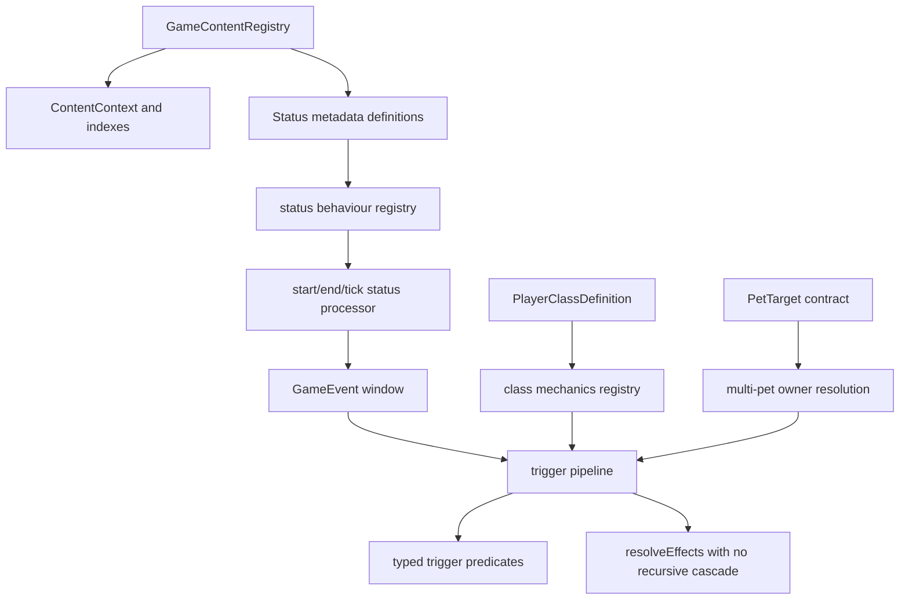

# Expansion Readiness Refactor Plan

## Summary

Refactor the third layer of combat expansion foundations so future player classes, multiple active pets, status behaviours, triggers, and pet/class modifiers can be added through typed data and focused engine surfaces rather than new hardcoded branches.

## Problem Frame

The first two refactor rounds made the combat engine much easier to extend: effects have descriptors, content has an index, statuses are registered as metadata, pet modifier triggers are isolated, animation planning is event-driven, and saves carry content version information. That is enough for a small content pool, but the next expansion pressure points are still visible.

Status runtime behaviour is effectively Burn-only, pet modifier triggers are still shaped around one defeated-with-status trigger and draw-only triggered effects, player classes are mostly starter configuration, and multi-pet ownership has partial support without a stronger contract for ordering, targeting, trigger ownership, and class slot policy. This plan keeps current gameplay behaviour stable while making those contracts explicit and testable before new content multiplies.

## Requirements

**Status behaviour**

- R1. Runtime status behaviour must move behind typed, registry-backed behaviour descriptors while preserving current Burn event order, damage, expiry, and validation behaviour.
- R2. The status system must be ready for additional deterministic behaviours such as poison, mark, weak, vulnerable, regen, or guard without adding a new top-level `if statusId === ...` branch for each status.
- R3. Registry validation must distinguish between registered status metadata and statuses that have supported runtime behaviour for `applyStatus`, tick timing, and modifier trigger matching.

**Trigger and modifier expansion**

- R4. Pet modifier trigger resolution must use a general trigger window contract with explicit ordering, owner, limit, phase, outcome, and cascade rules.
- R5. Triggered modifier effects must resolve through the existing effect resolver where safe, instead of remaining draw-only, while preserving current Ash Instinct behaviour.
- R6. The trigger pipeline must remain deterministic and must not prebuild unrelated relic or passive abstractions until a concrete owner exists.

**Class and multi-pet readiness**

- R7. Player class definitions must gain a typed mechanics surface for class-owned modifiers, class tags, starting resources, or trigger hooks without moving class logic into Phaser.
- R8. Multi-pet target and owner resolution must have one reusable contract shared by card play, pet command modifiers, triggered effects, validation, and tests.
- R9. Current Phase 1 one-pet content must continue to work unchanged, while test fixtures demonstrate two active pets and class-limited pet slots.

**Quality and boundaries**

- R10. `src/game-core` must remain deterministic, browser-free, and Phaser-free.
- R11. Core changes must include focused event-order, rejection-path, multi-pet, seeded-RNG, status expiry, and trigger limit tests.
- R12. Public exports and existing content should remain backward-compatible unless the implementation deliberately introduces a typed migration path.

## Key Technical Decisions

- **Behaviour descriptors, not scripts:** Status runtime behaviour should be modelled with typed descriptors and engine-owned resolver functions. Content may identify supported behaviours, but arbitrary callbacks or scripts do not enter content data.
- **One status metadata registry, separate runtime support registry:** `GameContentRegistry.statuses` remains the content-facing metadata collection. A core behaviour registry maps supported status ids or behaviour keys to deterministic handlers, allowing unknown loaded statuses to display safely while gameplay rejects unsupported runtime effects.
- **Trigger windows over trigger-specific functions:** The trigger pipeline should receive a typed frame such as before state, after state, event window, phase, owner context, and RNG. Existing defeated-with-status matching becomes one trigger predicate inside that pipeline.
- **Use `resolveEffects` for triggered effects with guardrails:** Trigger-generated effects should reuse the same effect resolver for event order and future effect support, but the pipeline must prevent accidental recursive trigger loops unless a later feature explicitly opts in.
- **Class mechanics are data-owned, engine-resolved:** Player class definitions can reference class modifiers or class feature ids. Combat systems resolve them through core modules; Phaser view models only display the resulting state.
- **Multi-pet ordering is stable by active slot order:** Any effect or modifier that targets multiple pets resolves owners in `activePetInstanceIds` order unless an explicit seeded random target is requested.

## High-Level Technical Design

The third refactor should add extension points only where the current code already has real pressure. It should avoid a generic ability engine, ECS, scripting layer, or full relic/passive system until a concrete gameplay feature needs them.

## Implementation Units

### U1. Status Behaviour Registry

- **Goal:** Replace Burn-only runtime branching with a typed status behaviour registry that preserves all existing Burn behaviour.
- **Files:** `src/game-core/model/status.ts`, `src/game-core/systems/statuses.ts`, `src/game-core/systems/effect-validation.ts`, `src/game-core/systems/validation.ts`, `src/game-core/data/registry.ts`, `src/game-core/index.ts`, `tests/game-core/combat-status.test.ts`, `tests/game-core/registry.test.ts`, `tests/game-core/content-index.test.ts`, `tests/game-phaser/combat-view-model.test.ts`.
- **Approach:** Extend `StatusDefinition` with optional deterministic behaviour metadata or add a parallel core behaviour descriptor keyed by status id. Move Burn ticking into a handler table with explicit timing such as `startOfTurn`. Preserve registered metadata fallback for view models. Validation should accept metadata-only statuses for display but reject `applyStatus` effects when no runtime behaviour exists.
- **Patterns:** Follow `src/game-core/systems/effect-descriptors.ts` for descriptor shape and `src/game-core/systems/statuses.ts` for existing event order.
- **Test Scenarios:** Burn ticks, deals block-ignoring damage, decrements stacks, expires, and emits events in the same order as before; unsupported runtime statuses still render through view models; applying a metadata-only status fails registry validation; duplicate status ids still fail index validation; dead combatants skip status processing unchanged.
- **Verification:** Run focused status, registry, content-index, and combat view-model tests, then `npm run typecheck` and `npm test`.

### U2. Trigger Window Pipeline

- **Goal:** Generalise pet modifier trigger resolution around typed trigger windows while keeping existing pet modifier owner semantics and Ash Instinct behaviour stable.
- **Files:** `src/game-core/model/pet.ts`, `src/game-core/systems/trigger-rules.ts`, `src/game-core/systems/pet-modifiers.ts`, `src/game-core/systems/combat.ts`, `src/game-core/systems/statuses.ts`, `src/game-core/systems/validation.ts`, `tests/game-core/pet-modifier-trigger-rules.test.ts`, `tests/game-core/pet-modifier-ash-instinct.test.ts`, `tests/game-core/pet-modifier-multi-pet.test.ts`, `tests/game-core/combat-play-card.test.ts`.
- **Approach:** Introduce a `TriggerWindow` and a trigger matcher table for current pet modifier trigger rules. Keep owner collection in pet modifier code, but pass owner context into the pipeline. Make phase and outcome rules explicit: player-turn triggers run only while combat continues, triggered effects do not recursively produce more modifier triggers in this unit, and limit consumption happens before triggered effects to preserve once-per-turn behaviour.
- **Patterns:** Preserve `PetModifierActivated`, `PetModifierConsumed`, `CardDrawn`, and `CardMoved` event order from current tests.
- **Test Scenarios:** Defeated-with-status trigger still matches status present before events, status applied during the same event window, and rejects status expired before defeat; no trigger fires during enemy turn; once-per-turn and once-per-combat limits remain stable; multi-pet modifier owners resolve in active pet order; trigger rejection emits `ActionRejected` without mutating from an invalid original state.
- **Verification:** Run focused trigger, pet modifier, combat play-card, and status tests, then `npm run typecheck` and `npm test`.

### U3. Triggered Effect Resolution

- **Goal:** Allow trigger rules to execute supported `EffectDefinition[]` through the shared effect resolver instead of manually aggregating draw effects.
- **Files:** `src/game-core/model/pet.ts`, `src/game-core/systems/pet-modifiers.ts`, `src/game-core/systems/effects.ts`, `src/game-core/systems/effect-validation.ts`, `src/game-core/systems/validation.ts`, `tests/game-core/pet-modifier-ash-instinct.test.ts`, `tests/game-core/pet-modifier-integration.test.ts`, `tests/game-core/registry.test.ts`.
- **Approach:** Replace draw-only trigger execution with guarded calls into `resolveEffects`. The trigger context should provide a deterministic source id, default target policy, card metadata where absent, and no recursive trigger cascade. Validation should allow safe current effect types for trigger effects and reject effects that need unavailable targets unless the rule declares an explicit target.
- **Patterns:** Use the existing `resolveEffects` result shape and event appending style rather than a separate mini resolver.
- **Test Scenarios:** Existing Ash Instinct draw output is byte-for-byte equivalent in state and event order; a test-only trigger effect can apply block or status through the shared resolver; malformed target-dependent trigger effects are rejected at validation; combat victory/loss stops remaining trigger effects; seeded random pet targets remain deterministic.
- **Verification:** Run focused pet modifier and registry tests, then `npm run typecheck` and `npm test`.

### U4. Player Class Mechanics Surface

- **Goal:** Add a small, data-driven surface for future class mechanics without implementing a full class feature catalogue.
- **Files:** `src/game-core/model/player.ts`, `src/game-core/model/registry.ts`, `src/game-core/systems/content-index.ts`, `src/game-core/systems/run-lifecycle.ts`, `src/game-core/systems/combat.ts`, `src/game-core/systems/validation.ts`, `src/game-core/data/players/novice-tamer.ts`, `tests/game-core/run-lifecycle.test.ts`, `tests/game-core/combat.test.ts`, `tests/game-core/registry.test.ts`, `tests/game-core/content-index.test.ts`.
- **Approach:** Extend player class definitions with optional class modifier ids or class feature definitions that can later participate in trigger windows. For this unit, wire only inert or validation-visible class mechanics so current gameplay stays unchanged. Validate class feature references and enforce `maxActivePets` / `petSlotCount` consistently.
- **Patterns:** Mirror the pet modifier shape only where there is actual reuse; avoid coupling class definitions to pet-specific upgrade state.
- **Test Scenarios:** Novice Tamer remains behaviourally unchanged; a fixture class with two active pet slots can create a run with two pets; too many pets still rejects with the existing action error; unknown class modifier references fail validation; class metadata is indexed and serialisable.
- **Verification:** Run focused run lifecycle, combat creation, registry, and index tests, then `npm run typecheck` and `npm test`.

### U5. Multi-Pet Target and Owner Resolver

- **Goal:** Centralise pet target and pet command owner resolution so multi-pet cards, pet modifiers, and class mechanics share one deterministic rule set.
- **Files:** `src/game-core/model/effect.ts`, `src/game-core/systems/effects.ts`, `src/game-core/systems/pet-modifiers.ts`, new `src/game-core/systems/pet-targets.ts`, `src/game-core/systems/combat.ts`, `src/game-core/testing/combat-fixtures.ts`, `tests/game-core/combat-pet-command.test.ts`, `tests/game-core/pet-modifier-multi-pet.test.ts`, `tests/game-core/card-actions.test.ts`.
- **Approach:** Extract `resolvePetTargets`, `resolvePetCommandOwnerIds`, and validation-adjacent pet target checks into a focused helper. Define stable owner ordering, `requiresPetDefinitionId` fallback behaviour, seeded random selection, and missing tagged pet rejection once. Keep public behaviour compatible with existing card play and pet modifier tests.
- **Patterns:** Preserve branded id types and seeded `Rng` usage. Do not hardcode Ember Fox.
- **Test Scenarios:** `leading`, `allActive`, `specific`, `randomActive`, and `withTag` all resolve as expected; missing active pets and missing tagged pets reject with stable codes; pet-command owner resolution scopes modifiers to the resolved owners; cards requiring a pet definition still find the matching active pet; two-pet fixture coverage proves deterministic owner ordering.
- **Verification:** Run focused pet target, pet command, multi-pet modifier, and card action tests, then `npm run typecheck` and `npm test`.

### U6. Documentation, Reports, and Expansion Guardrails

- **Goal:** Leave concise durable guidance and test/report coverage so future content work uses the new extension points correctly.
- **Files:** `docs/design.md` or a short new doc under `docs/`, `docs/codex-skills.md` if needed, `src/game-core/testing/content-report.ts`, `tests/game-core/content-authoring.test.ts`, `tests/game-core/vertical-slice-content.test.ts`, `docs/plans/2026-05-27-015-expansion-readiness-refactor-plan.md`.
- **Approach:** Update only short developer-facing docs for status behaviours, trigger windows, class mechanics, and multi-pet owner ordering. Extend the deterministic content report to include runtime-supported statuses, metadata-only statuses, trigger rule kinds, class mechanics references, and multi-pet fixture coverage.
- **Patterns:** Keep docs in UK English and avoid speculative design essays.
- **Test Scenarios:** Content report remains deterministic; report includes supported status behaviours and trigger rule kinds; docs name the supported extension points and deferred non-goals; the plan status is flipped to completed only after implementation and validation.
- **Verification:** Run focused content-report tests, then `npm run typecheck` and `npm test`.

## Scope Boundaries

- Do not add new player classes, pets, relics, card pools, bosses, or story content beyond minimal fixtures needed for tests.
- Do not rebalance existing cards, pet upgrades, monsters, rewards, or starter deck content.
- Do not create a generic scripting system, ECS, editor, external content pipeline, or full relic/passive framework.
- Do not move gameplay decisions into `src/game-phaser`.
- Do not weaken save compatibility, animation, event-order, simulation, or boundary tests.

## System-Wide Impact

This refactor touches combat status processing, pet modifier triggers, shared effect resolution, player class definitions, multi-pet target semantics, registry validation, content reporting, and selected Phaser view-model fallbacks. Each unit should land with focused tests before moving on because event order and deterministic resolution are load-bearing for both gameplay and animation playback.

## Risks & Dependencies

- **Event-order drift:** Moving Burn and trigger effects behind registries can reorder `StatusTicked`, `DamageDealt`, `CombatantDefeated`, `PetModifierActivated`, `CardDrawn`, and `CardMoved`. Characterisation tests must pin order before and after extraction.
- **Over-generalisation:** A generic ability engine would slow the project down. This plan only generalises surfaces with immediate pressure: status behaviours, trigger windows, class mechanics references, and pet owner resolution.
- **Trigger recursion bugs:** Reusing `resolveEffects` for trigger effects can accidentally cascade triggers. This unit should explicitly disable recursive trigger resolution until real content requires it.
- **Validation churn:** Tightening supported-runtime-status checks can alter error codes or paths. Preserve existing public issue shapes unless a new precise issue is intentionally introduced and covered.
- **Multi-pet UI mismatch:** Core can support more pet mechanics than Phase 1 UI presents. Phaser changes should stay to view-model fallbacks and warnings unless a core contract requires more.

## Acceptance Examples

- AE1. Given a monster has Burn at start of turn, status processing emits the same tick, damage, expiry, outcome, and trigger events as before the refactor.
- AE2. Given content registers a metadata-only Frost status, view models can display it but registry validation rejects cards that try to apply it as a runtime status until behaviour support exists.
- AE3. Given Ash Instinct sees a burned enemy defeated during the player turn, it activates, consumes its limit, and draws in the same order as current tests.
- AE4. Given a trigger rule later uses a non-draw supported effect in tests, it resolves through the shared effect resolver without recursive trigger cascades.
- AE5. Given a fixture class allows two active pets, run creation accepts two provided pet instances and combat owner resolution processes them in active slot order.
- AE6. Given a pet-command card targets all active pets, pet command modifiers apply only for the resolved owner pets and seeded random targeting remains deterministic.
- AE7. Given invalid class mechanics, unsupported status behaviour, or malformed trigger effects are present in content, registry validation reports precise errors before gameplay.

## Documentation / Operational Notes

Keep documentation changes short and close to the code paths they describe. The most useful durable notes are the status behaviour descriptor contract, trigger window no-recursion rule, player class mechanics extension point, and multi-pet owner ordering.

## Sources / Research

- Current status runtime behaviour: `src/game-core/systems/statuses.ts`, `src/game-core/model/status.ts`, `tests/game-core/combat-status.test.ts`.
- Current effect resolution and validation: `src/game-core/systems/effects.ts`, `src/game-core/systems/effect-descriptors.ts`, `src/game-core/systems/effect-validation.ts`, `tests/game-core/card-actions.test.ts`.
- Current pet modifier triggers and multi-pet ownership: `src/game-core/systems/pet-modifiers.ts`, `src/game-core/systems/trigger-rules.ts`, `tests/game-core/pet-modifier-ash-instinct.test.ts`, `tests/game-core/pet-modifier-multi-pet.test.ts`.
- Current player class and run creation contracts: `src/game-core/model/player.ts`, `src/game-core/systems/run-lifecycle.ts`, `src/game-core/data/players/novice-tamer.ts`, `src/game-core/testing/run-fixtures.ts`.
- Existing expansion refactor context: `docs/plans/2026-05-26-013-combat-enrichment-refactor-foundation-plan.md`, `docs/plans/2026-05-26-014-combat-expansion-refactor-plan.md`.
