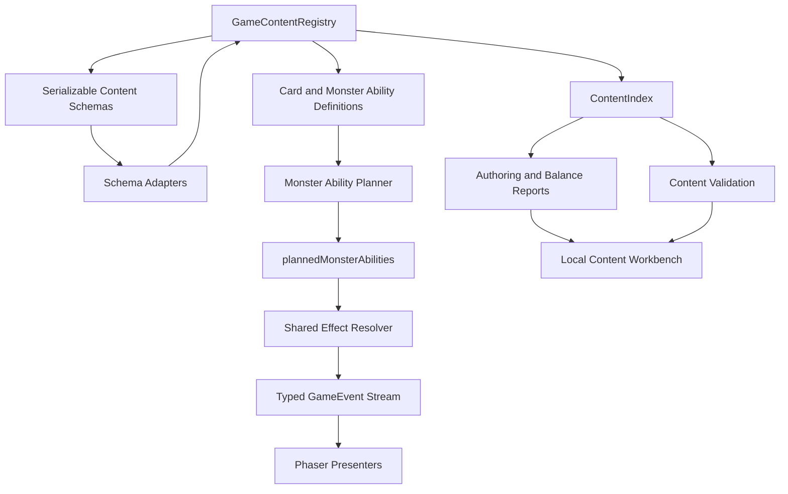

# Game Ready Content Engine and Authoring Foundation Plan

## Summary

This plan turns the current playable roguelite core into a more game-ready engine for content growth. The work is deliberately phased: monster abilities become planned card-like actions first, shared ability infrastructure and serialisable content schemas come next, then authoring reports and editor foundations can sit on top without moving gameplay rules into Phaser.

---

## Problem Frame

The engine already has a `GameContentRegistry`, deterministic combat events, monster definitions, intent pools, encounter schedules, run maps, status behaviours, pet modifiers, save migrations, and simulation tooling. The main remaining gap is that several future-facing concepts are still too implicit for long-term content authoring:

- Monsters select intents with direct effects, but they do not yet play registered card-like abilities that can be planned, revealed, validated, simulated, and edited like other combat content.
- Player cards, pet-command cards, and monster actions share effect resolution concepts, but their authoring surfaces are not yet unified around ability descriptors and target rules.
- Content is authored as TypeScript objects, which is strong for engine safety but weak as an editor contract.
- Level, monster, card, player, pet, and status editors need a stable serialisable schema, dependency graph, validation diagnostics, preview models, and balance reports before a full UI editor is worth building.

The work should keep `src/game-core` deterministic and renderer-free. Phaser may display planned monster abilities and consume typed events, but it must not decide ability legality, target selection, status timing, or encounter progression.

---

## Requirements

**Monster Ability Runtime**

- R1. Monsters must have registered card-like ability definitions that can be selected into a planned next action before execution.
- R2. Planned monster actions must be represented in combat state and emitted through typed events so UI can eventually reveal the next monster card without changing combat rules.
- R3. Existing monster behaviour must remain equivalent unless a phase explicitly migrates data from direct intents to registered abilities.
- R4. Monster ability execution must use the same deterministic effect-resolution infrastructure as existing combat actions and must preserve seeded RNG determinism.

**Shared Ability and Content Contracts**

- R5. Player cards, pet-command cards, and monster abilities must converge on shared descriptors for effects, target requirements, preview metadata, and validation where the behaviours are genuinely shared.
- R6. The content registry and content index must expose all new definition families with duplicate-id detection and stable diagnostics.
- R7. Serialisable content schemas must exist for editor-facing data before any editor UI writes content.
- R8. TypeScript content and serialisable content must round-trip or compile through explicit adapters, not ad hoc string manipulation.

**Authoring and Balance Readiness**

- R9. Content validation must catch missing ids, invalid effect payloads, invalid target rules, orphaned references, impossible schedules, and unsupported runtime statuses.
- R10. Reports must surface content dependency, coverage, and balance-relevant facts needed by card, monster, level, player, pet, and status editors.
- R11. Level and encounter authoring must support act/node/encounter/monster composition, difficulty budget metadata, and editor diagnostics without requiring a visual editor first.
- R12. Simulation and smoke tooling must include the new monster ability path so regressions are visible before UI work.

**Editor Foundation**

- R13. Editor-facing view models must be separated from gameplay resolution and safe to consume from Phaser or future tooling.
- R14. The first editor workbench, if implemented in this plan, must be a local content workbench over schemas and diagnostics, not a replacement gameplay surface.
- R15. Documentation must describe the extension points and authoring workflow enough for future content additions to avoid engine branches.

**Quality Gates**

- R16. Each phase must pass typecheck, unit tests, relevant focused tests, simulation smoke, and a browser runtime smoke when UI/runtime paths are touched.
- R17. Each phase must receive independent code review and contract-audit review; any actionable or advisory finding is treated as blocking until fixed or explicitly disproved by stronger evidence.
- R18. Each phase must commit and push only after validation and review gates are green.

---

## Key Technical Decisions

- KTD1. Monster abilities are distinct definitions, not reused player cards by default: Monster cards need hidden/planned metadata, AI selection hints, cooldowns or schedules, and player-facing reveal rules. They can share effect and descriptor infrastructure with cards without pretending they are deck cards.
- KTD2. Existing monster intents become presentation categories over planned abilities: The UI still gets `attack`, `block`, `debuff`, and `special` signals, but the source becomes a planned ability id. This preserves the current intent display while enabling future card reveal mechanics.
- KTD3. Editor schemas are serialisable and validated before UI: A full editor without schemas would bake unstable assumptions into UI code. JSON-safe schema definitions, adapters, diagnostics, and reports are the first editor deliverable.
- KTD4. TypeScript content remains the canonical runtime content for now: The first pass should not introduce a database or external content pipeline. Serialisable editor content can compile into the existing registry shape.
- KTD5. Reports are treated as authoring infrastructure, not optional documentation: Dependency graphs, content coverage, and balance summaries are the practical way to keep hundreds of future cards, statuses, monsters, pets, and levels manageable.
- KTD6. Phaser stays a consumer of view models and events: Planned monster card reveal, editor workbench views, and card/status previews must not move gameplay resolution or validation into `src/game-phaser`.

---

## High-Level Technical Design

The engine keeps one deterministic runtime path: choose or play an ability, resolve typed effects, emit typed events, and let presentation consume those events. Authoring tools operate on schemas, diagnostics, dependency reports, and preview view models; they do not execute separate gameplay rules.

---

## Implementation Units

### U1. Monster ability registry and planned action state

- **Goal:** Add a registered monster ability model and planned-action combat state while preserving current behaviour.
- **Files:** `src/game-core/model/monster.ts`, `src/game-core/model/combat.ts`, `src/game-core/model/event.ts`, `src/game-core/model/registry.ts`, `src/game-core/systems/content-index.ts`, `src/game-core/systems/monster-intents.ts`, `src/game-core/data/monsters/forest-monsters.ts`, `tests/game-core/monster-intents.test.ts`.
- **Approach:** Introduce `MonsterAbilityDefinition` and `PlannedMonsterAbility`. Let existing intent definitions reference ability ids or be migrated behind a compatibility adapter. Emit planning and execution events that carry ability ids plus current intent presentation fields.
- **Test Scenarios:** Planned abilities are selected deterministically from schedule and pool; missing ability ids reject with stable diagnostics; dead monsters do not plan actions; existing forest monsters produce equivalent damage/status/block outcomes; event order records plan before execution.
- **Verification:** `npm run typecheck`, focused monster intent tests, `npm test`, `npm run sim:smoke`.

### U2. Shared ability descriptors and target contracts

- **Goal:** Extract shared authoring concepts for card and monster ability effect descriptors, target requirements, and preview metadata.
- **Files:** `src/game-core/model/card.ts`, `src/game-core/model/monster.ts`, `src/game-core/model/effect.ts`, `src/game-core/systems/effect-descriptors.ts`, `src/game-core/systems/effect-validation.ts`, `src/game-core/systems/card-actions.ts`, `src/game-core/systems/monster-intents.ts`, `tests/game-core/effect-validation.test.ts`, `tests/game-core/card-actions.test.ts`.
- **Approach:** Keep card and monster definitions separate at the top level, but share small typed primitives such as ability tags, target requirement descriptors, display intent descriptors, and effect summaries.
- **Test Scenarios:** Attack cards, pet-command cards, no-target cards, self cards, all-enemy cards, and monster abilities report correct target requirements; invalid effect payloads fail validation consistently; descriptors are stable for editor consumption.
- **Verification:** Focused descriptor tests, action tests, typecheck, full test suite.

### U3. Serialisable content schema foundation

- **Goal:** Add JSON-safe schema types and adapters for cards, monster abilities, monsters, encounters, players, pets, statuses, and run maps.
- **Files:** `src/game-core/model/content-schema.ts`, `src/game-core/systems/content-schema.ts`, `src/game-core/systems/validation.ts`, `src/game-core/data/registry.ts`, `tests/game-core/content-schema.test.ts`, `tests/game-core/registry.test.ts`.
- **Approach:** Define explicit serialisable schemas in TypeScript types first. Provide adapter functions that convert schema objects into runtime registry definitions and return structured diagnostics instead of throwing.
- **Test Scenarios:** Valid schema content compiles into the existing starter registry shape; invalid references produce path-specific diagnostics; duplicate ids across schema collections are caught; schema output is JSON round-trip safe.
- **Verification:** Schema tests, registry validation tests, typecheck, full test suite.

### U4. Content dependency graph and authoring diagnostics

- **Goal:** Build dependency and coverage reports for editor and reviewer workflows.
- **Files:** `src/game-core/testing/content-report.ts`, `src/game-core/testing/content-dependencies.ts`, `src/game-cli/simulate-runs.ts`, `tests/game-core/content-report.test.ts`, `tests/game-core/content-dependencies.test.ts`.
- **Approach:** Index references from cards, monster abilities, monsters, encounters, players, pets, upgrades, statuses, stories, and run maps. Report missing, orphaned, unused, and high-risk references with stable codes.
- **Test Scenarios:** A monster ability referencing a missing status is reported; an encounter referencing a missing monster is reported; unused cards and unused statuses are visible as warnings; dependency graph output is deterministic.
- **Verification:** Focused report tests, CLI report output check, typecheck, full tests.

### U5. Level and encounter authoring model

- **Goal:** Make level composition manageable through act, node, encounter, monster-group, difficulty-budget, and reward-pool metadata.
- **Files:** `src/game-core/model/encounter.ts`, `src/game-core/model/run-map.ts`, `src/game-core/data/encounters/forest-encounters.ts`, `src/game-core/data/run-maps/act1-forest.ts`, `src/game-core/systems/validation.ts`, `tests/game-core/run-map.test.ts`, `tests/game-core/validation.test.ts`.
- **Approach:** Extend existing encounter and run-map definitions with optional authoring metadata that simulation and validation can read without changing combat resolution.
- **Test Scenarios:** Combat nodes validate encounter type and budget metadata; invalid monster group composition is reported; existing run map remains playable; simulation can summarise encounter budget and completion rate.
- **Verification:** Run-map tests, validation tests, `npm run sim:balance` when stable enough for the current slice, smoke simulation.

### U6. Balance and simulation reporting upgrade

- **Goal:** Expand automated reports so balancing content is practical before a visual editor exists.
- **Files:** `src/game-core/testing/analysis.ts`, `src/game-core/testing/simulation.ts`, `src/game-cli/simulate-runs.ts`, `package.json`, `tests/game-core/simulation.test.ts`, `tests/game-core/analysis.test.ts`.
- **Approach:** Add monster ability usage, card usage, reward pick rate, status frequency, damage-by-encounter, and run-path summaries to the existing deterministic simulator.
- **Test Scenarios:** Reports count planned and played monster abilities; status frequency includes player and monster applications; reward pick summaries remain deterministic for a seed; strict health checks fail on impossible or content-dead runs.
- **Verification:** Simulation tests, `npm run sim:smoke`, `npm run sim:balance`, full tests.

### U7. Local content workbench foundation

- **Goal:** Provide an editor foundation that surfaces content lists, schemas, diagnostics, dependency graph summaries, and previews without executing gameplay rules in the UI.
- **Files:** `src/game-phaser` only if integrated into the existing app shell, or a new `src/content-workbench` surface if a separate Vite route is cleaner; shared view models under `src/game-core/systems/content-workbench.ts`; tests under `tests/game-core/content-workbench.test.ts`.
- **Approach:** Start as read-only or import/export-first. Editing controls can be added only after schemas and validators are stable. The workbench consumes core view models and diagnostics.
- **Test Scenarios:** Workbench view model lists cards, monsters, monster abilities, statuses, players, pets, run maps, validation diagnostics, and dependency warnings; no Phaser import exists in core; preview metadata matches descriptor tests.
- **Verification:** View-model tests, typecheck, browser smoke if the app route changes.

### U8. Documentation, migration notes, and runtime proof

- **Goal:** Update extension docs and produce evidence that the engine works after the phased changes.
- **Files:** `docs/expansion-extension-points.md`, `docs/ui_ux_interaction.md` where planned monster reveal affects UI contracts, phase plan notes under `docs/plans/`, optional solution note under `docs/solutions/` if a reusable pattern emerges.
- **Approach:** Keep docs concise and tied to real extension points. Avoid speculative editor manual text until the workbench has concrete behaviour.
- **Test Scenarios:** Documentation references current files and terminology; no stale direct-intent-only claims remain; browser smoke demonstrates app startup and combat path after the new ability planner.
- **Verification:** Manual doc review, `npm run typecheck`, `npm test`, `npm run sim:smoke`, browser smoke against local Vite or preview server, PR CI.

---

## Phase Gates

Each phase lands independently unless the implementation proves a split would create unsafe intermediate states. The default order is U1 through U8. For every phase:

- Run focused tests for changed systems.
- Run `npm run typecheck`.
- Run `npm test`.
- Run `npm run sim:smoke`; run `npm run sim:balance` when balance or encounter reporting changes.
- Run a browser smoke when app runtime or presentation-facing view models change.
- Dispatch two independent reviews: code reviewer and contract auditor.
- Treat every actionable or advisory review finding as blocking until fixed, tested, or disproved with direct evidence.
- Commit and push the phase only after the worktree is clean and validation evidence is captured.

---

## Scope Boundaries

- Deferred for later: full visual drag-and-drop level editor, full card art workflow, remote content storage, hosted CMS, live balancing dashboard, collaborative editing, and mod support.
- In scope only as foundations: editor schemas, adapters, validation diagnostics, dependency graph, reports, and a local workbench or view model.
- Out of scope: moving gameplay rules into Phaser, changing current card balance for design preference, replacing the deterministic core with a scripting engine, or introducing a database before content schemas prove the need.

---

## System-Wide Impact

This work touches the core combat contract, content registry, validation, save compatibility assumptions, simulation analysis, and UI-facing event stream. It should avoid save format churn unless new combat state must be serialised; if save fields are added, migration and compatibility validation must be updated in the same phase. The current first playable slice must remain playable throughout.

---

## Risks and Dependencies

- Monster abilities could duplicate card systems too aggressively. Mitigation: share primitives and resolvers, not the entire card model.
- Editor schemas could drift from runtime definitions. Mitigation: compile schemas into runtime registry definitions and test JSON round trips.
- Reports could become noisy and ignored. Mitigation: use stable severity codes and keep advisory output deterministic.
- Balance gates may be brittle while content is small. Mitigation: use strict gates for invariants and smoke gates for balance until enough content exists for stronger statistical thresholds.
- UI reveal of monster cards could overpromise hidden information. Mitigation: model planned abilities now, but keep reveal policy explicit and conservative.

---

## Acceptance Examples

- AE1. Given a Training Slime with a scheduled attack ability, when combat starts, the engine emits a planned monster ability event and stores that ability as the monster's next action before the monster turn executes it.
- AE2. Given a monster ability that applies an unknown status, when registry validation runs, validation fails with a path-specific error before combat starts.
- AE3. Given the same seed and same combat actions, when a run is simulated twice, monster ability planning and execution produce identical event sequences.
- AE4. Given a future editor loads serialisable content, when it compiles the schema into runtime content, duplicate ids and missing references are reported without partially mutating game state.
- AE5. Given the local app starts after these changes, when a user enters combat and plays a card, the combat loop still reaches monster planning, monster execution, next-turn draw, rewards, and map progression without console errors.

---

## Sources and Existing Patterns

- `src/game-core/model/monster.ts` currently defines intent pools and schedules.
- `src/game-core/systems/monster-intents.ts` currently chooses and resolves active monster intents.
- `src/game-core/model/registry.ts` and `src/game-core/systems/content-index.ts` are the registry/index patterns to extend.
- `src/game-core/systems/effect-validation.ts` and `src/game-core/systems/effects.ts` are the shared validation and resolution paths to preserve.
- `src/game-core/testing/content-report.ts`, `src/game-core/testing/simulation.ts`, and `src/game-cli/simulate-runs.ts` are the existing reporting and simulation surfaces.
- `docs/expansion-extension-points.md` records extension contracts from earlier refactors and should remain the concise system map.
