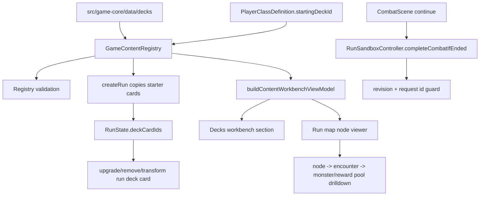

# Phase 15 Deck Registry Level Viewer Gate Hardening Plan

## Summary

Phase 15 turns the current hardening progress into a reliable authoring and validation baseline. The work makes the default test gate finish under the normal `npm test` script, removes review ZIP archive pollution, promotes player starter decks into first-class content, expands the workbench into a read-only level/run-map viewer, and closes the remaining safe-submit gap around combat completion.

The phase deliberately avoids new gameplay surface area. It should improve confidence in the existing first playable slice rather than adding a second pet, pet HP, enemy pet targeting, or a write editor.

## Problem Frame

Phase 14 improved the core/presentation contract, deck economy operations, workbench diagnostics, and reward/map request guards. The remaining blockers are validation reliability and authoring truth. Partitioned test files can pass while default `npm test` hangs, so the normal validation gate is not trustworthy enough for review. The engine has player starting deck data and run deck mutation, but there is no first-class deck registry for future starter variants, challenge decks, or authoring analysis. Run map and encounter data already describe node type, candidate encounters, monsters, budgets, and reward pools, but the workbench exposes only aggregate map counts rather than answering what happens on each node.

This plan treats those as hardening issues: make the default lane green, make review bundles clean, and make the workbench expose the content truth that the engine already knows.

---

## Requirements

**Validation gate and review packaging**

- R1. `npm test` must complete reliably under the default `package.json` script without relying on manual file partitioning.
- R2. Slow or expensive process-spawn coverage must either become cheap in the default unit lane or move behind an explicit integration lane while preserving CLI provenance assertions.
- R3. The required local validation gate must include `npm run typecheck`, `npm test`, `npm run build`, `npm run build:cli`, `npm run sim:smoke -- --analyze`, and `npm run sim:balance`.
- R4. Review ZIPs must exclude nested contract/archive repo snapshots under `docs/contracts/**` so review bundles do not contain stale `src/`, `tests/`, `.github/`, or `package.json` trees.
- R5. Review ZIP packaging must have an automated check proving nested repo-shaped contract archives cannot re-enter the bundle.

**Deck Registry**

- R6. Starter decks must be first-class content definitions with stable ids, names, owning player class ids, card ids, tags, authoring notes, and room for later unlock requirements.
- R7. Player class data must reference a starter deck id while preserving compatibility with current run creation and tests during the migration.
- R8. `RunState.deckCardIds` remains the mutable run deck and deck economy operations continue to act on run state, not on static starter definitions.
- R9. Registry validation must catch duplicate deck ids, empty starter decks, missing card references, player classes with unknown starting deck ids, and invalid owner/player class references.
- R10. The workbench must expose a Decks section showing deck size, card list, card types, pet-command count, rarity mix, tag distribution, authoring notes, and where-used by player class.

**Level and Run Map Viewer**

- R11. The workbench must expose every run map node with node id, type, layer, next node ids, encounter ids, event/story ids where available, authoring notes, and budget min/max.
- R12. Combat, elite, and boss nodes must expand candidate encounters with encounter name, type, monster ids, monster display names, monster roles, difficulty band, reward pool id, budget, and monster group composition.
- R13. Event and rest nodes must expose their current read-only meaning and placeholders without inventing write-mode editor behaviour.
- R14. Broken-reference drilldown must connect node to encounter to monster and reward pool so the workbench can explain missing dependencies at the relevant node.
- R15. Tests must prove the workbench can answer: "What happens if I step on this node?", "Which enemies can appear here?", "Which nodes are elite or boss?", and "Which reward pool does this encounter use?"

**Safe submit semantics**

- R16. `completeCombatIfEnded` must require expected revision and request id from production-facing combat scene continue calls.
- R17. Controller mutations used by Phaser scenes should require request ids on production paths while keeping test helpers ergonomic.
- R18. Duplicate combat-complete request ids and stale combat-complete revisions must reject or no-op deterministically without advancing run state twice.

**Scope boundaries**

- R19. Do not add a write editor.
- R20. Do not add a second pet.
- R21. Do not add pet HP.
- R22. Do not add enemy pet targeting.
- R23. Do not add a broad new content batch beyond the minimal deck registry migration data.
- R24. Do not weaken existing game-core/Phaser architecture boundary checks.

---

## Key Technical Decisions

- KTD1. Make starter decks a registry collection rather than a player-class array. `DeckDefinition` or `StarterDeckDefinition` should live in `src/game-core/model` and concrete data should live under `src/game-core/data`, keeping deck authoring data-driven and reusable outside a single class.
- KTD2. Keep run decks mutable and starter decks immutable. `createRun` should copy the resolved starter deck's card ids into `RunState.deckCardIds`; reward/deck-economy systems should never mutate static deck definitions.
- KTD3. Preserve a migration bridge for `startingDeckCardIds` only where it reduces churn. The final content source should be `startingDeckId`, but temporary compatibility may be useful for tests or old fixture shapes if validation clearly reports drift.
- KTD4. Build the level viewer from content reports, not Phaser map presenters. `src/game-core` should produce deterministic read-only authoring summaries; `src/app` renders them. Phaser scenes should not gain editor or resolver responsibility.
- KTD5. Treat review ZIP cleanliness as a testable packaging rule. The script can exclude all contract snapshot folders or delete repo-shaped nested entries after archive creation, but a focused test should prevent regressions.
- KTD6. Fix the default test lane at the root cause. Prefer moving nested build/process-spawn checks to an explicit integration script or converting them to direct entrypoint assertions over raising timeouts or depending on file ordering.
- KTD7. Make production submit guards stricter than ergonomic test helpers. Scene-facing controller calls should provide request ids and revisions; helper wrappers can generate them for tests that are not exercising submit idempotency.

---

## High-Level Technical Design

---

## Implementation Units

### U1. Stabilise the default Vitest lane

- **Goal:** Make `npm test` reliable under the default script while preserving meaningful CLI/runtime provenance coverage.
- **Files:** Modify `tests/game-cli/version.test.ts`, `package.json`, `vitest.config.ts`, `scripts/run-cli-entry.mjs`, and any new explicit integration test config only if needed.
- **Patterns:** Follow the existing direct `runNode` helper for cheap CLI entrypoint checks. Treat nested `npm run` and `build:cli` spawn coverage as candidates for an explicit integration lane if they are the source of suite hangs.
- **Test scenarios:** Default `npm test` completes; CLI `--version` returns `currentRuntimeMetadata`; JSON auto output includes runtime metadata; simulation provenance prints package/content/fingerprint/schema metadata; parse errors remain concise; any moved integration script still covers built CLI alignment.
- **Verification:** `npm test`, focused `npx vitest run tests/game-cli/version.test.ts`, and any new integration script if introduced.

### U2. Add a review ZIP pollution guard

- **Goal:** Prevent review ZIPs from including nested repo snapshots under contract/archive documentation.
- **Files:** Modify `scripts/create-review-zip.mjs`, `package.json` if a reusable check script is warranted, and add a focused test under `tests/scripts/` or the closest existing script-test location.
- **Patterns:** Preserve the current `git archive HEAD` flow, dirty-tree guard, `zip -T`, and narrow parent-folder housekeeping. Extend exclusions or post-archive deletion in a way that stays deterministic from committed `HEAD`.
- **Test scenarios:** A generated or inspected ZIP contains no `docs/contracts/**/src/`, `docs/contracts/**/tests/`, `docs/contracts/**/.github/`, or `docs/contracts/**/package.json`; help text lists excluded contract snapshot paths or explains the nested snapshot guard; existing `archive/`, `docs/evidence`, `docs/contracts/p1`, and `docs/contracts/p1.5` exclusions remain.
- **Verification:** Focused script test, `node --check scripts/create-review-zip.mjs`, and a real `npm run zip:review -- --allow-dirty` only after the tree state makes that safe.

### U3. Create first-class starter deck content

- **Goal:** Introduce static deck definitions and migrate Novice Tamer to reference a starter deck id.
- **Files:** Create or modify `src/game-core/model/deck.ts`, `src/game-core/data/decks/novice-tamer-starter.ts`, `src/game-core/model/player.ts`, `src/game-core/model/registry.ts`, `src/game-core/data/registry.ts`, `src/game-core/index.ts`, and run creation code in `src/game-core/systems/run.ts` or the existing run system file.
- **Patterns:** Mirror existing content model/data layout for cards, pets, encounters, rewards, and run maps. Use typed ids from `src/game-core/ids.ts`; add a `deckId` helper if the local id pattern calls for it.
- **Test scenarios:** Novice Tamer resolves `startingDeckId` to the same current nine-card starter list; run creation copies the starter deck into `RunState.deckCardIds`; deck economy upgrade/remove/transform still mutates only run deck state; JSON serialisation of registry/view models stays deterministic.
- **Verification:** `tests/game-core/run-integration.test.ts`, `tests/game-core/deck-economy.test.ts`, `tests/game-core/model-shape.test.ts`, and `npm run typecheck`.

### U4. Validate deck registry integrity

- **Goal:** Add registry validation and dependency-report coverage for deck definitions and player class deck references.
- **Files:** Modify `src/game-core/systems/validation.ts`, `src/game-core/testing/content-dependencies.ts`, `src/game-core/systems/content-workbench.ts`, and tests including `tests/game-core/registry.test.ts`, `tests/game-core/content-schema.test.ts`, `tests/game-core/content-dependencies.test.ts`, and `tests/game-core/content-workbench.test.ts`.
- **Patterns:** Follow existing validation issue shapes with stable `code`, `message`, and `path`. Feed dependency references through the existing `source` and `target` drilldown model.
- **Test scenarios:** Duplicate deck id reports an error; empty starter deck reports an error; missing card id in a deck reports an error and dependency issue; deck owner references an unknown player class reports an error; player class references unknown `startingDeckId`; valid starter registry has no new errors or warnings.
- **Verification:** Focused registry/content dependency tests and `npm test` once U1 is complete.

### U5. Expose Decks in the workbench

- **Goal:** Add a read-only Decks section that helps an author inspect starter deck composition and player-class usage.
- **Files:** Modify `src/game-core/systems/content-workbench.ts`, `src/game-core/workbench/index.ts`, `src/app/content-workbench.ts` or extracted workbench modules, and `tests/game-phaser/content-workbench-ui.test.ts`.
- **Patterns:** Use structured view-model data rather than formatted strings. Keep UI read-only and avoid resolver calls. If `src/app/content-workbench.ts` grows further, extract narrow modules while preserving behaviour.
- **Test scenarios:** Collections include `decks`; Novice Tamer starter deck shows deck size, card ids, card type counts, pet-command count, rarity mix, tag distribution, authoring notes, and where-used by `novice_tamer`; filtering can find the deck by card/tag/player usage; JSON preview remains stable.
- **Verification:** `tests/game-core/content-workbench.test.ts`, `tests/game-phaser/content-workbench-ui.test.ts`, `npm run build`.

### U6. Build the run map node detail report

- **Goal:** Extend core authoring summaries so each run map node can answer what happens when selected.
- **Files:** Modify `src/game-core/testing/level-authoring-report.ts`, `src/game-core/systems/content-workbench.ts`, `src/game-core/model/run-map.ts` if event/story metadata fields are added, and tests in `tests/game-core/level-authoring-report.test.ts` and `tests/game-core/content-workbench.test.ts`.
- **Patterns:** Enrich existing report shapes instead of adding gameplay resolution. Sort ids deterministically. Expand references from registry definitions so monster display names and reward pool ids are available without Phaser.
- **Test scenarios:** A combat node lists candidate encounter ids and names; `act1_forest_3_elite_a` is identifiable as elite with `charred_stag`; `act1_forest_4_boss_a` is identifiable as boss with `forest_warden`; reward pool id is visible for each candidate encounter; event/rest nodes show authoring notes or placeholder meaning.
- **Verification:** Focused level authoring and content workbench tests.

### U7. Render the read-only Level / Run Map Viewer

- **Goal:** Make the workbench UI expose the node detail report in a designer-usable read-only panel.
- **Files:** Modify `src/app/content-workbench.ts` or extracted modules under `src/app/content-workbench/`, styles in `src/app/styles.css`, and `tests/game-phaser/content-workbench-ui.test.ts`.
- **Patterns:** Keep it within the existing workbench route and fake-DOM test style. Prefer a structured node detail panel over a visual graph editor. Avoid in-app tutorial text.
- **Test scenarios:** Selecting a run map shows all nodes with type/layer/next ids; selecting or previewing a node shows candidate encounter details, monster names/roles, reward pool, budget, and broken-reference diagnostics; elite and boss nodes are discoverable by filter/search; event/rest nodes show their read-only meaning.
- **Verification:** Workbench UI tests, `npm run build`, and a browser smoke of the local workbench route if the dev server is running for final verification.

### U8. Tighten combat completion safe-submit semantics

- **Goal:** Require revision and request id for production combat-complete/continue paths and add duplicate/stale protection tests.
- **Files:** Modify `src/game-phaser/controllers/RunSandboxController.ts`, `src/game-phaser/scenes/CombatScene.ts`, `src/game-phaser/interaction/combat-action-submission.ts` if relevant, and tests such as `tests/game-phaser/run-controller.test.ts`, `tests/game-phaser/combat-action-submission.test.ts`, and `tests/game-phaser/combat-controller.test.ts`.
- **Patterns:** Reuse the existing `seenGameplayRequestIds` and revision guard style used by map, reward, play-card, and end-turn flows. Keep test helpers ergonomic by generating request ids where tests are not asserting idempotency.
- **Test scenarios:** Combat scene continue passes current revision and a unique request id; duplicate combat-complete request id is rejected or ignored without moving the run twice; stale revision rejects; successful combat completion still emits expected run/reward events in order.
- **Verification:** Focused Phaser controller/submission tests and `npm test`.

### U9. Run the full Phase 15 gate and update operational docs if needed

- **Goal:** Prove the phase is shippable and document only the durable contract changes future agents need.
- **Files:** Modify concise docs under `docs/contracts/` only if deck registry, level viewer, or submit semantics need durable contract notes.
- **Patterns:** Keep docs short and concrete. Do not create broad speculative architecture documents.
- **Test scenarios:** The required validation commands all pass; workbench and registry JSON are serialisable; review ZIP guard has focused coverage; safe-submit duplicate/stale tests prove idempotency.
- **Verification:** `npm run typecheck`, `npm test`, `npm run build`, `npm run build:cli`, `npm run sim:smoke -- --analyze`, and `npm run sim:balance`.

---

## Acceptance Examples

- AE1. Given a clean checkout, when `npm test` is run with the default script, then it completes without hanging and without manual file partitioning.
- AE2. Given a review ZIP is generated, when its entries are inspected, then no nested repo-shaped path exists below `docs/contracts/**`.
- AE3. Given Novice Tamer starts a run, when the run is created, then `RunState.deckCardIds` equals the cards from the referenced starter deck definition.
- AE4. Given a deck references a missing card, when registry validation and workbench dependency diagnostics run, then both identify the missing card at the deck path.
- AE5. Given the Decks workbench section is opened, when the Novice Tamer starter deck is selected, then the user can see deck size, card list, pet-command count, rarity mix, tag distribution, and where-used by player class.
- AE6. Given the Act 1 Forest run map is opened in the workbench, when node `act1_forest_3_elite_a` is inspected, then it shows the elite encounter, Charred Stag monster identity, roles, budget, and reward pool.
- AE7. Given the Act 1 Forest boss node is inspected, then the viewer shows Forest Warden and the boss reward pool without requiring Phaser or combat resolution.
- AE8. Given the combat continue action is submitted twice with the same request id, when the second submission reaches the controller, then run state is not advanced a second time.

---

## System-Wide Impact

This phase touches test configuration, CLI smoke coverage, review packaging, core content models, registry validation, run creation, workbench core models, app workbench rendering, and Phaser controller submit guards. It should not change combat balance, monster behaviour, card effects, pet upgrade mechanics, or map generation semantics except where starter deck lookup replaces inline player deck data.

The most important compatibility boundary is `RunState.deckCardIds`: save/run consumers should continue to see a plain mutable card id list. The new deck registry is an authoring/source-of-truth layer, not a replacement for run state.

---

## Risks & Dependencies

- Moving CLI tests out of the unit lane can accidentally reduce coverage. Mitigate by keeping direct runtime metadata assertions in `npm test` and adding an explicit integration script only for slow built-output alignment.
- Deck migration can create dual sources of truth if `startingDeckCardIds` and `startingDeckId` remain indefinitely. Mitigate by making one path canonical and validating mismatch or deprecated fallback use.
- Workbench level detail can balloon into an editor. Mitigate by keeping the UI read-only and by sourcing all facts from registry/report data.
- Review ZIP pollution may recur through a new nested snapshot folder name. Mitigate with a pattern-based nested repo check rather than only excluding known `p1`, `p1.5`, or `p2` names.
- Stricter request-id requirements may break tests that call controller methods directly. Mitigate with helper wrappers or generated ids in non-idempotency tests while keeping production scene calls explicit.

---

## Sources / Research

- `docs/plans/2026-05-27-020-phase-14-workbench-hardening-consolidation-plan.md` for the previous hardening scope and completed direction.
- `package.json`, `vitest.config.ts`, and `tests/game-cli/version.test.ts` for the current default test lane and CLI spawn coverage.
- `scripts/create-review-zip.mjs` for committed-HEAD review ZIP generation, dirty-tree guard, existing exclusions, and parent-folder housekeeping.
- `src/game-core/model/player.ts`, `src/game-core/data/players/novice-tamer.ts`, `src/game-core/model/run.ts`, and `src/game-core/systems/deck-economy.ts` for current player starting deck, mutable run deck, and deck operations.
- `src/game-core/model/registry.ts`, `src/game-core/data/registry.ts`, and `src/game-core/systems/validation.ts` for registry integration and validation issue patterns.
- `src/game-core/data/run-maps/act1-forest.ts`, `src/game-core/data/encounters/forest-encounters.ts`, `src/game-core/model/run-map.ts`, and `src/game-core/model/encounter.ts` for existing level authoring metadata.
- `src/game-core/testing/level-authoring-report.ts`, `src/game-core/systems/content-workbench.ts`, and `src/app/content-workbench.ts` for current authoring reports and workbench rendering.
- `src/game-phaser/controllers/RunSandboxController.ts`, `src/game-phaser/scenes/CombatScene.ts`, `src/game-phaser/scenes/MapScene.ts`, and `src/game-phaser/scenes/RewardScene.ts` for current request-id and revision submit patterns.
